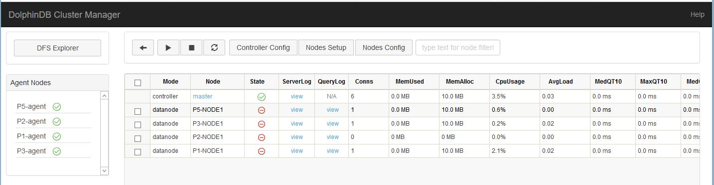
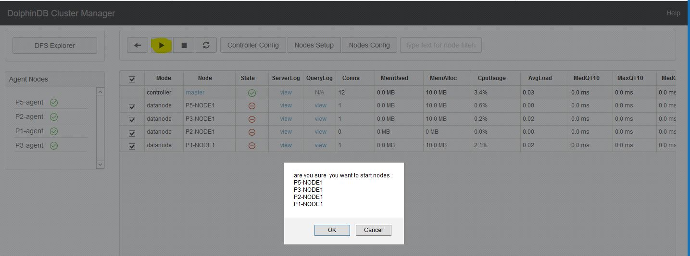
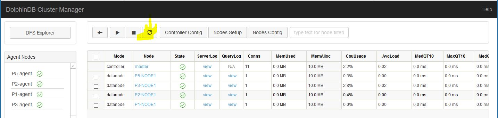
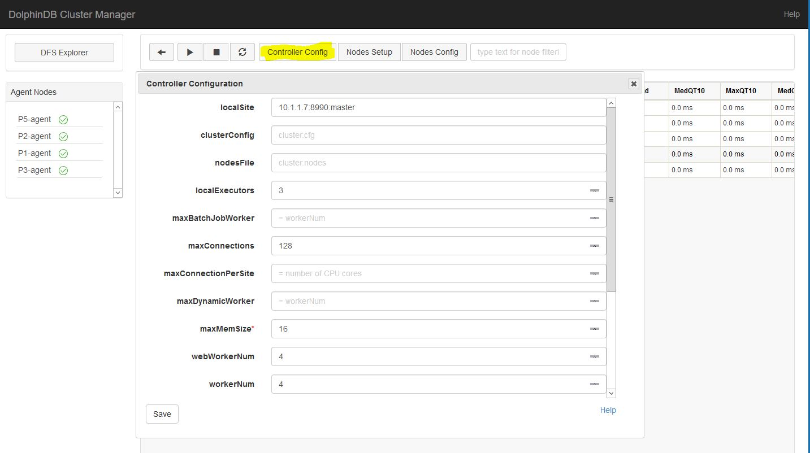
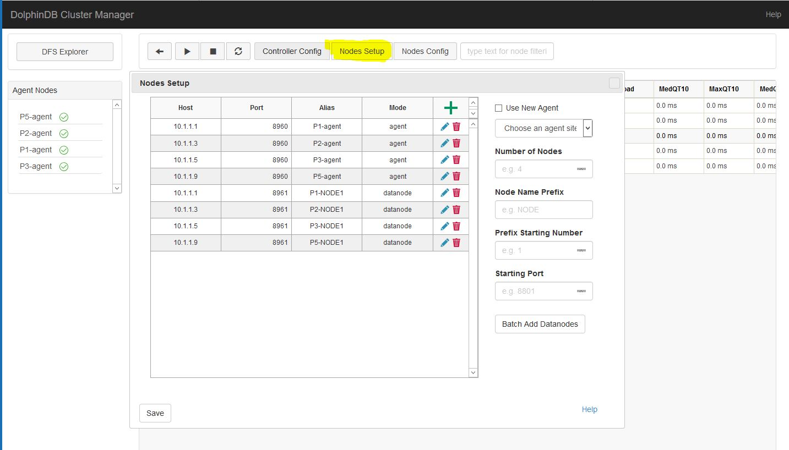
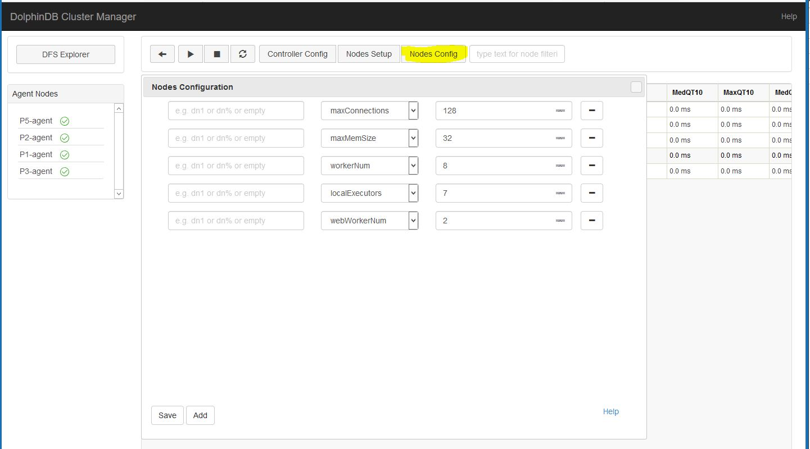

# 多服务器集群部署

本教程详细介绍了多服务器集群部署的步骤，以及分析了节点启动失败的可能原因。主要包含以下内容：

- [多服务器集群部署](#多服务器集群部署)
  - [1. 集群结构](#1-集群结构)
  - [2. 下载](#2-下载)
  - [3. 软件授权许可更新](#3-软件授权许可更新)
  - [4. DolphinDB server版本的更新](#4-dolphindb-server版本的更新)
  - [5. DolphinDB集群初始配置](#5-dolphindb集群初始配置)
    - [5.1 配置控制节点](#51-配置控制节点)
      - [5.1.1 配置控制节点的参数文件](#511-配置控制节点的参数文件)
      - [5.1.2 配置集群成员参数文件](#512-配置集群成员参数文件)
      - [5.1.3 配置数据节点、计算节点的参数文件](#513-配置数据节点计算节点的参数文件)
    - [5.2 配置代理节点](#52-配置代理节点)
  - [6 DolphinDB集群启动](#6-dolphindb集群启动)
    - [6.1 systemd 启动DolphinDB](#61-systemd-启动dolphindb)
    - [6.2 命令行启动DolphinDB](#62-命令行启动dolphindb)
      - [6.2.1 启动代理节点](#621-启动代理节点)
      - [6.2.2 启动控制节点](#622-启动控制节点)
      - [6.2.3 关闭代理节点和控制节点](#623-关闭代理节点和控制节点)
    - [6.3 启动网络上的集群管理器](#63-启动网络上的集群管理器)
    - [6.4 DolphinDB权限控制](#64-dolphindb权限控制)
    - [6.5 启动数据节点](#65-启动数据节点)
  - [7. 节点启动失败可能原因](#7-节点启动失败可能原因)
  - [8. 基于Web的集群管理](#8-基于web的集群管理)
    - [8.1 控制节点参数配置](#81-控制节点参数配置)
    - [8.2 增删数据节点](#82-增删数据节点)
    - [8.3 数据节点参数配置](#83-数据节点参数配置)
    - [8.4 设置集群管理器通过外网访问](#84-设置集群管理器通过外网访问)
    - [8.5 设置数据卷](#85-设置数据卷)
  - [9. 云部署](#9-云部署)

## 1. 集群结构

DolphinDB Cluster包括四种类型节点：数据节点（data node），计算节点( compute node ) ，代理节点（agent）和控制节点（controller）。

- 数据节点：用于数据存储。可以在数据节点创建分布式数据库表。
- 计算节点：只用于计算，包括流计算、分布式关联、机器学习等。计算节点不存储数据，故不可在该节点上建库建表，但可以通过 [loadTable](https://dolphindb.cn/cn/help/FunctionsandCommands/FunctionReferences/l/loadTable.html) 加载数据进行计算
- 代理节点：用于关闭或开启数据节点
- 控制节点：用于集群元数据的管理和数据节点间任务的协调。
  
请注意，集群中任意一个数据节点或计算节点都可以作为客户端，进行数据读取，但是控制节点仅用于内部管理协调，不能作为任务的主入口

本教程假设有五个物理节点: **P1**, **P2**, **P3**, **P4**, **P5**。
这五个物理节点的对应的内网地址为

```txt
P1: 10.1.1.1
P2: 10.1.1.3
P3: 10.1.1.5
P4: 10.1.1.7
P5: 10.1.1.9
```

我们将控制节点设置在**P4**节点上，在其它每个节点上设置一个代理节点和一个数据节点。这里需要说明一下：

- 节点的IP地址需要使用内网IP。如果使用外网地址，不能保证节点间网络通信性能。

- 每个物理节点必须要有一个代理节点，用于启动和关闭该物理节点上的一个或多个数据节点。

- DolphinDB每个集群（非高可用集群）有且仅有一个控制节点。

## 2. 下载

在每个物理节点上，从[DolphinDB](http://www.dolphindb.com/downloads.html)网站下载DolphinDB，并解压到一个指定目录。例如解压到如下目录

```sh
/DolphinDB
```
>请注意：安装路径的目录名中不能含有空格字符，也不能含有中文字符，否则启动数据节点时会失败。

## 3. 软件授权许可更新

与社区版本相比，企业版支持更多的节点，CPU 内核和内存。如果用户拿到了企业版试用授权许可，只需用其替换如下授权许可文件即可。请注意：每个物理节点的授权许可文件都需要替换。

```sh
/DolphinDB/server/dolphindb.lic
```
##  4. DolphinDB server版本的更新
为了避免软件授权许可和配置信息丢失，下载最新版本的 server 后，请覆盖更新除 `dolphindb.lic` 和 `dolphindb.cfg` 以外的文件。

## 5. DolphinDB集群初始配置

启动一个集群，必须配置控制节点和代理节点。数据节点可以在集群启动后通过 web 界面来配置，也可以在启动集群前通过配置文件手工配置。

### 5.1 配置控制节点

在配置集群的时候请核对授权文件规定的节点个数以及每个节点最多内核。如果配置超出授权文件规定的数量，集群将无法正常启动，异常信息将会记录在log文件中。

DolphinDB 缺省情况下会将 server 所在目录作为 home 目录，所有的配置文件和 log 文件也都会放在 home 目录下面。

配置文件，数据文件和log文件的默认路径如下：

```shell
cd /DolphinDB/server/clusterDemo/config
cd /DolphinDB/server/clusterDemo/data
cd /DolphinDB/server/clusterDemo/log
```

#### 5.1.1 配置控制节点的参数文件

登录 **P4** 服务器，在 `config` 目录下，查看 `controller.cfg` 文件，可填写以下集群管理的常用参数。用户可根据实际需要调整参数。`controller.cfg` 文件中只有 *localSite* 是必需的。其它参数都是可选参数

```txt
localSite=10.1.1.7:8990:master
mode=controller
dfsReplicationFactor=1
dfsReplicaReliabilityLevel=2
dataSync=1
workerNum=4
localExecutors=3
maxConnections=512
maxMemSize=8
lanCluster=0
```

参数解释：

| 参数配置        | 解释          |
|:------------- |:-------------|
|localSite=10.1.1.7:8990:master|     节点局域网信息,格式为 IP地址:端口号:节点别名，所有字段都是必选项。|
|localExecutors=3          |         本地执行线程的数量。默认值是CPU的内核数量 - 1。|
|maxConnections=512     |            最大向内连接数|
|maxMemSize=16          |            最大内存（GB）|
|webWorkerNum=4              |       处理http请求的工作池的大小。默认值是1。|
|workerNum=4        |                常规交互式作业的工作池大小。默认值是CPU的内核数量。|
|dfsReplicationFactor=2         |    每个表分区或文件块的副本数量。默认值是2。|
|dfsReplicaReliabilityLevel=1     |  多个副本是否可以保存在同一台物理服务器上。 0：是; 1：不。默认值是0。|
|dataSync=1         |   是否使用Redo Log功能。0：不；1：是。默认值为0。若设置为1，则需同步配置cluster.cfg中chunkCacheEngineMemSize。|

#### 5.1.2 配置集群成员参数文件

在 **P4** 服务器的 `config` 目录下，查看 `cluster.nodes` 文件，可填写如下内容。用户可根据实际需要调整参数。`cluster.nodes` 用于存放集群代理节点和数据节点信息。该配置文件分为两列，由逗号 “,” 分隔，第一例存放节点IP地址，端口号和节点别名。这三个信息由冒号 “:” 分隔。节点别名是大小写敏感的，而且在集群内必须是唯一的。第二列是说明节点类型。比如代理节点类型为 agent ,而数据节点类型为 datanode ，计算节点为 computenode。

本例中集群的节点配置信息需要包含位于 **P1**, **P2**, **P3**, **P5** 的代理节点和数据节点信息。

```txt
localSite,mode
10.1.1.1:8960:P1-agent,agent
10.1.1.1:8961:P1-NODE1,datanode
10.1.1.3:8960:P2-agent,agent
10.1.1.3:8961:P2-NODE1,datanode
10.1.1.5:8960:P3-agent,agent
10.1.1.5:8961:P3-NODE1,datanode
10.1.1.9:8960:P5-agent,agent
10.1.1.9:8961:P5-NODE1,datanode
```

#### 5.1.3 配置数据节点、计算节点的参数文件

在 **P4** 服务器的 config 目录下，查看 `cluster.cfg` 文件，并填写如下内容。`cluster.cfg` 用于存放对集群中每个数据节点/计算节点都适用的配置参数，用户可根据实际情况调整参数，每个参数的详细说明请参阅用户手册中 [单实例参数配置](https://www.dolphindb.cn/cn/help/DatabaseandDistributedComputing/Configuration/StandaloneMode.html)。

```txt
maxConnections=512
maxMemSize=32
workerNum=8
localExecutors=7
webWorkerNum=2
newValuePartitionPolicy=add
chunkCacheEngineMemSize=2

```

### 5.2 配置代理节点

登录 **P1**, **P2**, **P3** 和 **P5**，在 config 目录下，查看 `agent.cfg` 文件，并填写如下内容。用户可根据实际情况，调整参数。下面列出 **P1**, **P2**, **P3** 和 **P5** 每台服务器上的 `agent.cfg` 内容。这些参数中 *localSite* 和 *controllerSite* 是必需的，其它参数是可选的。


**P1**

```txt
mode=agent
workerNum=4
localExecutors=3
maxMemSize=4
lanCluster=0
localSite=10.1.1.1:8960:P1-agent
controllerSite=10.1.1.7:8990:master
```

**P2**

```txt
mode=agent
workerNum=4
localExecutors=3
maxMemSize=4
lanCluster=0
localSite=10.1.1.3:8960:P2-agent
controllerSite=10.1.1.7:8990:master
```

**P3**

```txt
mode=agent
workerNum=4
localExecutors=3
maxMemSize=4
lanCluster=0
localSite=10.1.1.5:8960:P3-agent
controllerSite=10.1.1.7:8990:master
```

**P5**

```txt
mode=agent
workerNum=4
localExecutors=3
maxMemSize=4
lanCluster=0
localSite=10.1.1.9:8960:P5-agent
controllerSite=10.1.1.7:8990:master
```

由于代理节点依照 `agent.cfg` 中的 *controllerSite* 参数值来寻找控制节点并与其通信，`controller.cfg` 中的 *localSite* 参数值应与所有 `agent.cfg` 中的 *controllerSite* 参数值一致。 若改变 `controller.cfg` 中的 *localSite* 参数值，即使只是别名改变，所有 `agent.cfg` 中的 *controllerSite* 参数值都应做相应改变。

## 6 DolphinDB集群启动

目前有两种方式启动集群，第一种是通过配置 systemd 的守护进程的方式启动，第二种是通过命令行的方式启动。

### 6.1 systemd 启动DolphinDB

首先在 `<dolphindbServer>/server/clusterDemo` 中加入脚本 `controller.sh` 以及 `agent.sh，`其内容如下:

```
#!/bin/bash
#controller.sh
workDir=$PWD

start(){
    cd ${workDir} && export LD_LIBRARY_PATH=$(dirname "$workDir"):$LD_LIBRARY_PATH
    nohup ./../dolphindb -console 0 -mode controller -home data -script dolphindb.dos -config config/controller.cfg -logFile log/controller.log -nodesFile config/cluster.nodes -clusterConfig config/cluster.cfg > controller.nohup 2>&1 &
}

stop(){
    ps -o ruser=userForLongName -e -o pid,ppid,c,time,cmd |grep dolphindb|grep -v grep|grep $USER|grep controller| awk '{print $2}'| xargs kill -TERM
}

case $1 in
    start)
        start
        ;;
    stop)
        stop
        ;;
    restart)
        stop
        start
        ;;
esac
```

```
#!/bin/bash
#agent.sh


workDir=$PWD

start(){
    cd ${workDir} && export LD_LIBRARY_PATH=$(dirname "$workDir"):$LD_LIBRARY_PATH
    nohup ./../dolphindb -console 0 -mode agent -home data -script dolphindb.dos -config config/agent.cfg -logFile log/agent.log  > agent.nohup 2>&1 &
}

stop(){
    ps -o ruser=userForLongName -e -o pid,ppid,c,time,cmd |grep dolphindb|grep -v grep|grep $USER|grep agent| awk '{print $2}'| xargs kill -TERM
}

case $1 in
    start)
        start
        ;;
    stop)
        stop
        ;;
    restart)
        stop
        start
        ;;
esac
```

**controller** 

配置 controller 的守护进程：

```shell
$ vim /usr/lib/systemd/system/ddbcontroller.service
```

配置如下内容：

```
[Unit]
Description=ddbcontroller
Documentation=https://www.dolphindb.com/

[Service]
Type=forking
WorkingDirectory=/home/jwu/hav1.30.16/server/clusterDemo
ExecStart=/bin/sh controller.sh start
ExecStop=/bin/sh controller.sh stop
ExecReload=/bin/sh controller.sh restart
Restart=always
RestartSec=10s
LimitNOFILE=infinity
LimitNPROC=infinity
LimitCORE=infinity

[Install]
WantedBy=multi-user.target
```

> 注意：
>
> 配置中WorkingDirectory需要进行修改为`<dolphindbServer>/server/clusterDemo`

- 启动 controller：
```
systemctl enable ddbcontroller.service   #配置自启
systemctl start ddbcontroller.service  #启动
systemctl stop  ddbcontroller.service   #停止服务
systemctl status  ddbcontroller.service  #检测状态
```

**agent**

配置 agent 的守护进程：

```shell
$ vim /usr/lib/systemd/system/ddbagent.service
```

配置如下内容：

```
[Unit]
Description=ddbagent
Documentation=https://www.dolphindb.com/

[Service]
Type=forking
WorkingDirectory=/home/jwu/hav1.30.16/server/clusterDemo
ExecStart=/bin/sh agent.sh start
ExecStop=/bin/sh agent.sh stop
ExecReload=/bin/sh agent.sh restart
Restart=always
RestartSec=10s
LimitNOFILE=infinity
LimitNPROC=infinity
LimitCORE=infinity

[Install]
WantedBy=multi-user.target
```

> 注意：
>
> 配置中WorkingDirectory需要进行修改为`<dolphindbServer>/server/clusterDemo`

- 启动 agent：

```
systemctl enable ddbagent.service   #配置自启
systemctl start ddbagent.service  #启动
systemctl stop  ddbagent.service   #停止服务
systemctl status  ddbagent.service  #检测状态
```

### 6.2 命令行启动DolphinDB

#### 6.2.1 启动代理节点

登录 **P1**, **P2**, **P3** 和 **P5**，在每一台服务器的 server 目录，即可执行文件所在目录下运行以下命令行。如果出现 agent 无法正常启动的情况，可以根据 `agent.log` 来诊断错误原因。`agent.log` 文件存放在 log 子目录下。

**Linux 后台模式启动**

```sh
nohup ./dolphindb -console 0 -mode agent -home data -config config/agent.cfg -logFile log/agent.log &
```

建议通过 Linux 命令 nohup（头） 和 &（尾）启动为后台运行模式，这样即使终端失去连接，DolphinDB 也会持续运行。

“-console” 表示是否启动 DolphinDB 终端，默认是为 1，表示启动终端。如果要设置为后台运行，必须设置为0（"-console 0")，否则系统运行一段时间后会自动退出。“-mode” 表示节点性质，“-home” 指定数据以及元数据存储路径，“-config” 指定配置文件路径，“-logFile” 指定 log 文件路径。

**Linux 前端交互模式启动**

```sh
./dolphindb -mode agent -home data -config config/agent.cfg -logFile log/agent.log
```

> 对应 startAgent.sh 启动脚本

**Windows 下启动**

```sh
dolphindb.exe -mode agent -home data -config config/agent.cfg -logFile log/agent.log
```

#### 6.2.2 启动控制节点

进入 **P4** 服务器，在 server 目录，即可执行文件所在目录下运行以下命令行。注意如果出现 controller 无法正常启动的情况，可以根据 `controller.log` 来诊断错误原因。`controller.log` 文件存放在 log 子目录下。

“-clusterConfig” 用于指定集群节点配置文件路径，“-nodesFile” 用于指定集群节点的类型、IP地址、端口号、别名信息。

**Linux 后台模式启动**

```sh
nohup ./dolphindb -console 0 -mode controller -home data -config config/controller.cfg -clusterConfig config/cluster.cfg -logFile log/controller.log -nodesFile config/cluster.nodes &
```

**Linux 前端交互模式启动**

```sh
./dolphindb -mode controller -home data -config config/controller.cfg -clusterConfig config/cluster.cfg -logFile log/controller.log -nodesFile config/cluster.nodes
```

> 对应 startController.sh 启动脚本

**Windows 下启动**

```sh
dolphindb.exe -mode controller -home data -config config/controller.cfg -clusterConfig config/cluster.cfg -logFile log/controller.log -nodesFile config/cluster.nodes
```

#### 6.2.3 关闭代理节点和控制节点

如果启动为前端交互模式，可以在控制台中输入"quit" 退出。

```sh
quit
```

如果启动为后台交互模式，需要用 linux 系统 `kill` 命令。假设运行命令的 linux 系统用户名为 "ec2-user"：

```sh
ps aux | grep dolphindb  | grep -v grep | grep ec2-user|  awk '{print $2}' | xargs kill -TERM
```

> 对应 `stopAllNode.sh` 关掉进程脚本。

### 6.3 启动网络上的集群管理器

启动控制节点和代理节点之后，可以通过 DolphinDB 提供的集群管理界面来开启或关闭数据节点。在浏览器的地址栏中输入控制节点IP和端口号(目前支持 Chrome 与 Firefox)：

```sh
10.1.1.7:8990
```



### 6.4 DolphinDB权限控制

DolphinDB database 提供了良好的安全机制。只有系统管理员才有权限做集群部署。在初次使用 DolphinDB 网络集群管理器时，需要用以下默认的系统管理员账号登录。

```txt
系统管理员帐号名: admin
默认密码: 123456
```

点击登录链接


输入管理员用户名和密码


使用上述账号登录以后，可修改"admin"的密码，亦可添加管理员或非管理员用户。

### 6.5 启动数据节点

选择所有数据节点，点击执行图标，并确定。节点启动可能要耗时30秒到一分钟。点击刷新图标来查看状态。若看到State栏全部为绿色对勾，则整个集群已经成功启动。





也可在控制节点执行以下代码来启动数据节点：

```txt
startDataNode(["P1-NODE1", "P2-NODE1","P3-NODE1","P5-NODE1"])
```

如果出现长时间无法正常启动，请查看 log 目录下该节点的 logFile. 如果节点名字是 DFS_NODE1，那对应的 logFile 应该在 log/DFS_NODE1.log。

## 7. 节点启动失败可能原因

如果节点长时间无法启动，可能有以下原因：

* **端口号被占用**
  
   查看 log 文件，如果 log 文件中出现错误信息 "Failed to bind the socket on XXXX"，这里的 XXXX 是待启动的节点端口号。这可能是该端口号已经被其他程序占用，这种情况下将其他程序关闭或者重新给 DolphinDB 节点分配端口号在重新启动节点即可，也有可能是刚刚关闭了该节点，Linux kernel 还没有释放此端口号。这种情况下稍等 30 秒，再启动节点即可。

* **防火墙未开放端口**
   
   如果使用到被防火墙限制的端口，需要在防火墙中开放它们。

* **配置文件中的IP地址、端口号或节点别名没有书写正确。**
   
    默认情况下集群采用 UDP 发送心跳，若发现 agent 节点进程已经启动，但是集群 web 界面上却显示不在线，可能是集群所在网络不支持 UDP 协议，可尝试将心跳机制改为 TCP 方式发送，即在 `agent.cfg` 和 `cluster.cfg` 文件中添加配置项 *lanCluster*=0。
   
* **集群成员配置文件cluster.nodes第一行为空行**
   
   查看 log 文件，如果 log 文件中出现错误信息 "Failed to load the nodes file [XXXX/cluster.nodes] with error: The input file is empty."，表示 `cluster.nodes` 的第一行为空行，这种情况下只需将文件中的空行删除，再重新启动节点即可。

* **宏变量\<ALIAS>在明确节点的情况下使用无效**
   
   查看配置文件cluster.cfg，若在明确了节点的情况下使用宏变量\<ALIAS>，如： P1-NODE1.persistenceDir = /hdd/hdd1/streamCache/\<ALIAS>, 则会导致该节点无法正常启动。这种情况下只需要把\<ALIAS>删除，替换成特定节点即可，如：
   ```
   P1-NODE1.persistenceDir = /hdd/hdd1/streamCache/<ALIAS>
   ```

   则会导致该节点无法正常启动。这种情况下只需要把<ALIAS>删除，替换成特定节点即可，如：

   ```
   P1-NODE1.persistenceDir = /hdd/hdd1/streamCache/P1-NODE1; 
   ```

   若想对所有节点使用宏变量, 则做如下修改：

   ```
   persistenceDir = /hdd/hdd1/streamCache/<ALIAS>
   ```
   宏变量的具体使用可详情参照 [DolphinDB用户手册](https://www.dolphindb.com/help/DatabaseandDistributedComputing/Configuration/ClusterMode.html)。


## 8. 基于Web的集群管理

经过上述步骤，我们已经成功部署DolphinDB集群。可通过DolphinDB的网络界面提供更改集群配置的所有功能。

### 8.1 控制节点参数配置

点击 "Controller Config" 按钮会弹出一个控制界面，这里的 *localExectors*, *maxConnections*, *maxMemSize*, *webWorkerNum* 以及 *workerNum* 等参数的值为 5.1.1 中 `controller.cfg` 里的配置值。这些配置信息都可以在这个界面上进行更改，修改的配置会在重启控制节点之后生效。
注意如果改变了控制节点的 *localSite* 参数值，一定要对所有 `agent.cfg` 中的 *controllerSite* 参数做相应修改，否则集群将无法正常运行。对于高可用集群，手动修改配置文件无效，必须通过 web 界面修改配置项，web 端会自动同步到集群中的所有配置文件。



### 8.2 增删数据节点

点击 "Nodes Setup" 按钮，会进入集群节点配置界面。下图显示的配置信息是我们在 5.1.2 中的 `cluster.nodes` 里配置的。在此界面中可以添加或删除数据节点。修改后的配置在整个集群重启之后生效。集群重启的具体步骤为：
1.关闭所有数据节点
2.关闭代理节点
3.关闭控制节点
4.启动控制节点
5.启动代理节点
6.启动数据节点

请注意，如果节点上已经存放数据，删除节点有可能会造成数据丢失。



若新的数据节点位于一个新的物理机器上，我们必须在此物理机器上根据 5.2 中的步骤配置并启动一个新的代理节点，在 `cluster.nodes` 中增加有关新的代理节点和数据节点的信息，并重新启动控制节点。

### 8.3 数据节点参数配置

点击 "Nodes Config" 按钮, 可进行数据节点配置。以下参数是在 5.1.3 中 `cluster.cfg` 里配置的。用户可以根据实际应用在这里添加其它配置参数。修改后的参数在重启所有数据节点后即可生效。




### 8.4 设置集群管理器通过外网访问

通常，集群所有节点同属一个内网时，将 *site* 信息设置为内网地址，使节点间的网络通信更加高效。若同时需要通过外网地址访问集群管理器，需要在 controller 上配置 *publicName* 选项，用来指定外网访问的地址。*publicName* 可以设置为域名或者 IP 地址，如果要启动 HTTPS，则必须是域名。举个例子，要设置 **P1**, **P2**, **P3** 和 **P5** 上所有节点的外网地址，需要在 `cluster.cfg` 中填入如下信息。% 是节点别名的通配符。

```txt
P1-%.publicName=19.56.128.21
P2-%.publicName=19.56.128.22
P3-%.publicName=19.56.128.23
P5-%.publicName=19.56.128.25
```

另外controller.cfg也要加上相应的外网域名或IP, 例如

```txt
publicName=19.56.128.24
```

### 8.5 设置数据卷

数据卷是位于数据节点上的文件夹，用来保存分布式文件系统的数据。一个节点可以有多个数据卷。要确保最优性能，每个数据卷应当对应不同的物理设备。如果多个数据卷对应同一个物理设备，会影响性能。

可在 `cluster.cfg` 中设置数据卷的路径。如果用户不设置数据卷的路径，系统会默认按数据节点别名来设置数据卷的路径。若节点别名为 P5-NODE1，系统会自动在该节点的 home 目录下创建一个名为 P5-NODE1 的子目录来存储数据。注意：数据卷只支持绝对路径，不支持相对路径。

三种设置数据卷路径的方法：

(1) **对每个节点分别指定数据卷路径**

```txt
P3-NODE1.volumes=/DFS/P3-NODE1
P5-NODE1.volumes=/DFS/P5-NODE1
```

(2) **通过 % 和 ? 通配符**

？代表单个字符; ％表示0,1或多个字符。

将所有以"-NODE1"为结尾的节点的数据存放到 /VOL1/：

```txt
%-NODE1.volumes=/VOL1/
```

等同于：

```txt
P1-NODE1.volumes=/VOL1/
P2-NODE1.volumes=/VOL1/
P3-NODE1.volumes=/VOL1/
P5-NODE1.volumes=/VOL1/
```

(3) **通过ALIAS通配符**

若所有数据节点的数据卷路径都含有节点别名，可使用 <ALIAS> 来配置数据卷路径。可用以下代码为每台服务器配置两个物理卷 /VOL1/ 和 /VOL2/：

```txt
volumes=/VOL1/<ALIAS>,/VOL2/<ALIAS>
```

等同于：

```txt
P1-NODE1.volumes=/VOL1/P1-NODE1,/VOL2/P1-NODE1
P2-NODE1.volumes=/VOL1/P2-NODE1,/VOL2/P2-NODE1
P3-NODE1.volumes=/VOL1/P3-NODE1,/VOL2/P3-NODE1
P5-NODE1.volumes=/VOL1/P5-NODE1,/VOL2/P5-NODE1
```

## 9. 云部署

DolphinDB 集群既可以部署在局域网内，也可以部署在私有云或公有云上。DolphinDB 默认集群的所有节点在一个局域网内（*lanCluster*=1）并通过 UDP 广播来监测节点心跳。但是在云平台上，所有节点不一定位于一个局域网，也有可能不支持 UDP。所以，在云平台上，需要在 `controller.cfg` 和 `agent.cfg` 填入*lanCluster*=0 来实现非 UDP 模式的节点之间的通讯。否则，由于可能无法正常检测到节点的心跳，集群可能无法正常工作。

更多详细信息，请参考DolphinDB帮助文档第10章

- [中文](https://www.dolphindb.cn/cn/help/DatabaseandDistributedComputing/Configuration/index.html)
- [英文](https://www.dolphindb.com/help/DatabaseandDistributedComputing/Configuration/index.html)