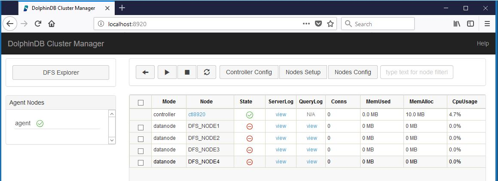
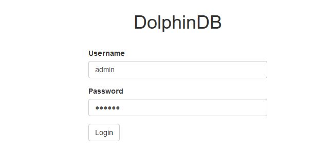
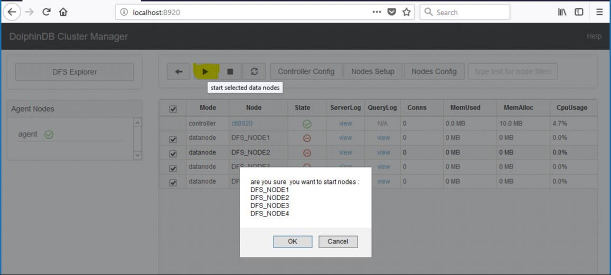
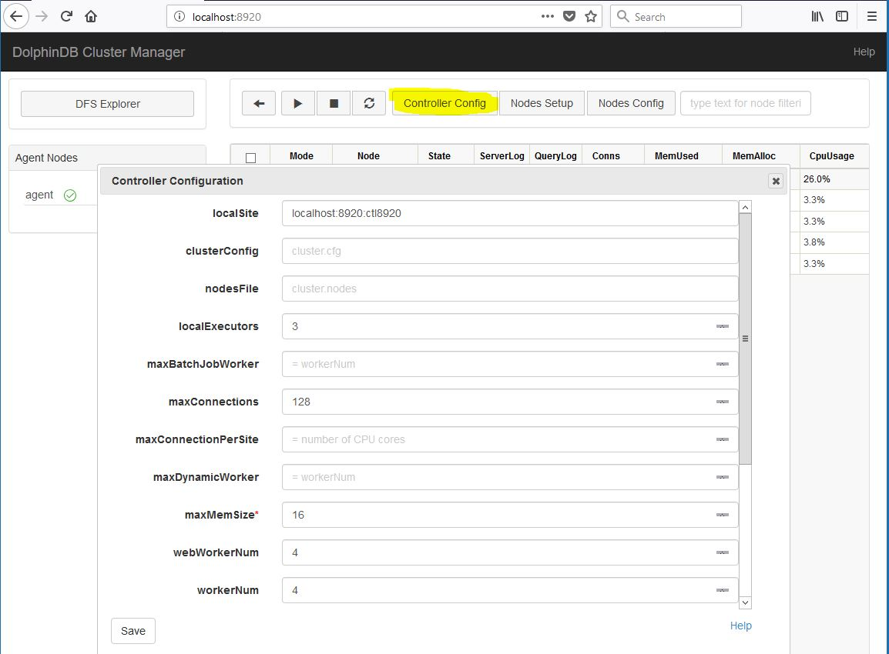
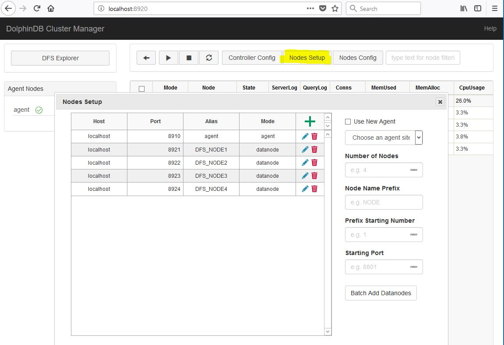
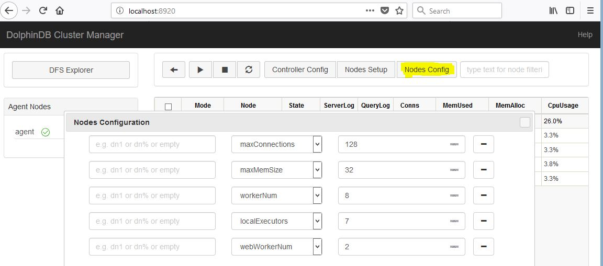

# 单服务器集群部署

DolphinDB集群包括三种类型节点：数据节点（data node），代理节点（agent）和控制节点（controller）。

* 数据节点用于数据存储，查询以及计算
* 代理节点用于关闭或开启数据节点
* 控制节点用于集群管理

本教程详细讲述了单服务器集群部署步骤，以及分析节点启动失败的可能原因。本教程包含以下内容：

- [单服务器集群部署](#单服务器集群部署)
  - [1. 下载](#1-下载)
  - [2. 软件授权许可更新](#2-软件授权许可更新)
  - [3. DolphinDB集群初始配置](#3-dolphindb集群初始配置)
    - [3.1 配置控制节点](#31-配置控制节点)
      - [3.1.1 配置控制节点的参数文件](#311-配置控制节点的参数文件)
      - [3.1.2 配置集群成员参数文件](#312-配置集群成员参数文件)
      - [3.1.3 配置数据节点参数文件](#313-配置数据节点参数文件)
    - [3.2 配置代理节点参数文件](#32-配置代理节点参数文件)
    - [3.3 DolphinDB集群启动](#33-dolphindb集群启动)
      - [3.3.1 启动代理节点](#331-启动代理节点)
        - [Linux后台模式启动](#linux后台模式启动)
        - [Linux启动前端交互模式](#linux启动前端交互模式)
        - [Windows](#windows)
      - [3.3.2 启动控制节点](#332-启动控制节点)
        - [Linux启动为后台模式](#linux启动为后台模式)
        - [Linux启动前端交互模式](#linux启动前端交互模式-1)
        - [Windows](#windows-1)
      - [3.3.3 如何关闭代理节点和控制节点](#333-如何关闭代理节点和控制节点)
      - [3.3.4 启动网络上的集群管理器](#334-启动网络上的集群管理器)
      - [3.3.5 DolphinDB权限控制](#335-dolphindb权限控制)
      - [3.3.6 启动数据节点](#336-启动数据节点)
  - [4. 节点启动失败可能原因分析](#4-节点启动失败可能原因分析)
  - [5. 基于Web的集群管理](#5-基于web的集群管理)
    - [5.1 控制节点参数配置](#51-控制节点参数配置)
    - [5.2 增删数据节点](#52-增删数据节点)
    - [5.3 修改数据节点参数](#53-修改数据节点参数)
  - [6. DolphinDB server版本的更新](#6-dolphindb-server版本的更新)
  - [7. DolphinDB集群详细配置以及参数意义](#7-dolphindb集群详细配置以及参数意义)

## 1. 下载

从DolphinDB官网下载DolphinDB，并解压到一个指定目录。例如解压到如下目录：

```sh
/DolphinDB
```
>请注意：安装路径的目录名中不能含有空格字符，也不能含有中文字符，否则启动数据节点时会失败。

## 2. 软件授权许可更新

如果用户拿到了企业版试用授权许可，只需用其把替换如下授权许可文件即可。每个物理节点的授权许可文件都需要更新。与社区版本相比，企业版支持更多的节点，CPU内核和内存。请注意社区版license最多支持2个节点，而本教程中使用了4节点，所以必须使用支持4个以上数据节点的企业版license。

```sh
/DolphinDB/server/dolphindb.lic
```

## 3. DolphinDB集群初始配置

启动一个集群之前，必须配置控制节点和代理节点。数据节点可以在集群启动后通过网络界面来配置，也可以在初始阶段配置。

### 3.1 配置控制节点

在配置集群时请核对授权文件规定的节点个数以及每个节点最多内核。如果配置超出授权文件规定，集群将无法正常启动。这些异常信息都会记录在log文件中。

进入server子目录。以Linux系统为例，在server目录下创建config, data及log子目录。 这些子目录是为了方便用户理解本教程，但是不是必须的。

```sh
cd /DolphinDB/server/

mkdir /DolphinDB/server/config
mkdir /DolphinDB/server/data
mkdir /DolphinDB/server/log
```

#### 3.1.1 配置控制节点的参数文件

在config目录下，创建controller.cfg文件，可填写以下集群管理的常用参数。用户可根据实际需要调整参数。controller.cfg文件中只有localSite参数是必需的，其它参数都是可选参数。

```txt
localSite=192.168.1.103:8920:ctl8920
localExecutors=3
maxConnections=512
maxMemSize=16
webWorkerNum=4
workerNum=4
dfsReplicationFactor=1
dfsReplicaReliabilityLevel=0
dataSync=1 
```

以下是对这些参数的解释：

| 参数配置        | 解释          |
|:------------- |:-------------|
|localSite=192.168.1.103:8920:ctl8920 |节点局域网信息，格式为 IP地址:端口号:节点别名，**IP地址为内网IP**，所有字段均为必选项。|
|localExecutors=3  |                 本地执行者的数量。默认值是CPU的内核数量 - 1。|
|maxConnections=512         |        最大向内连接数|
|maxMemSize=16    |                 最大内存（GB）|
|webWorkerNum=4  |                   处理http请求的工作池的大小。默认值是1。|
|workerNum=4          |              常规交互式作业的工作池大小。默认值是CPU的内核数量。|
|dfsReplicationFactor=1     |        每个表分区或文件块的副本数量。默认值是2。|
|dfsReplicaReliabilityLevel=0 |      多个副本是否可以保存在同一台物理服务器上。 0：可以; 1：不可以。默认值是0。|
|dataSync=1         |   数据库日志在事务提交前强制持久化到磁盘，cluster.cfg中chunkCacheEngineMemSize也需要配置。|

#### 3.1.2 配置集群成员参数文件

在config目录下，创建cluster.nodes文件，可填写如下内容。用户可根据实际需要调整参数。cluster.nodes用于存放集群代理节点和数据节点信息。本教程使用4个数据节点，用户可更改节点个数。该配置文件分为两列，第一例存放节点IP地址，端口号，和节点别名。这三个信息由冒号：分隔。第二列是说明节点类型。比如代理节点类型为agent, 而数据节点类型为datanode。节点别名是大小写敏感的，而且在集群内必须是唯一的。

```txt
localSite,mode
192.168.1.103:8910:agent,agent
192.168.1.103:8921:DFS_NODE1,datanode
192.168.1.103:8922:DFS_NODE2,datanode
192.168.1.103:8923:DFS_NODE3,datanode
192.168.1.103:8924:DFS_NODE4,datanode
```

#### 3.1.3 配置数据节点参数文件

在config目录下，创建cluster.cfg文件，可填写如下内容。用户可根据实际需要调整参数，每个参数的详细说明请参阅用户手册中[单实例参数配置](https://www.dolphindb.cn/cn/help/DatabaseandDistributedComputing/Configuration/StandaloneMode.html)。cluster.cfg的配置适用于集群中所有数据节点。


```txt
maxConnections=512
maxMemSize=32
workerNum=8
localExecutors=7
webWorkerNum=2
newValuePartitionPolicy=add
chunkCacheEngineMemSize=1
```

### 3.2 配置代理节点参数文件

在config目录下，创建agent.cfg文件，可填写如下常用参数。用户可根据实际需要调整参数。只有LocalSite和controllerSite是必需参数。其它参数均为可选参数。

```txt
workerNum=3
localExecutors=2
maxMemSize=4
localSite=192.168.1.103:8910:agent
controllerSite=192.168.1.103:8920:ctl8920
```

在controller.cfg中的参数localSite应当与所有代理节点的配置文件agent.cfg中的参数controllerSite一致, 因为代理节点使用agent.cfg中的参数controllerSite来寻找controller。若controller.cfg中的参数localSite有变化，即使只是node alias有改变，所有代理节点的配置文件agent.cfg中的参数controllerSite都应当做相应的改变。

### 3.3 DolphinDB集群启动

#### 3.3.1 启动代理节点

在可执行文件所在目录(server目录)运行以下命令行。请注意agent.log存放在log子目录下。如果出现agent无法正常启动的情况，可以查看此log file来诊断错误原因。

##### Linux后台模式启动

```sh
nohup ./dolphindb -console 0 -mode agent -home data -config config/agent.cfg -logFile log/agent.log &
```

建议通过Linux命令`nohup`（头） 和 `&`（尾）启动为后台运行模式，这样即使终端失去连接，DolphinDB也会持续运行。 

“-console”默认是为 1，如果要设置为后台运行，必须要设置为0（"-console 0")，否则系统运行一段时间后会自动退出。

“-mode”表示节点性质，“-home”指定数据以及元数据存储路径，“-config”指定配置文件路径，“-logFile”指定log文件路径。

##### Linux启动前端交互模式

```sh
./dolphindb -mode agent -home data -config config/agent.cfg -logFile log/agent.log
```

##### Windows

```sh
dolphindb.exe -mode agent -home data -config config/agent.cfg -logFile log/agent.log
```

#### 3.3.2 启动控制节点

在可执行文件所在目录(server目录)运行以下命令行。请注意controller.log存放在log子目录下，如果出现agent无法正常启动的情况，可以查看此log文件来诊断错误原因。

##### Linux启动为后台模式

```sh
nohup ./dolphindb -console 0 -mode controller -home data -config config/controller.cfg -clusterConfig config/cluster.cfg -logFile log/controller.log -nodesFile config/cluster.nodes &
```

##### Linux启动前端交互模式

```sh
./dolphindb -mode controller -home data -config config/controller.cfg -clusterConfig config/cluster.cfg -logFile log/controller.log -nodesFile config/cluster.nodes
```

##### Windows

```sh
dolphindb.exe -mode controller -home data -config config/controller.cfg -clusterConfig config/cluster.cfg -logFile log/controller.log -nodesFile config/cluster.nodes
```

#### 3.3.3 如何关闭代理节点和控制节点

如果是启动为前端交互模式，可以在控制台中输入"quit"退出。

```sh
quit
```

如果是启动为后台交互模式，需要用Linux系统`kill`命令。假设运行命令的Linux系统用户名为 "ec2-user"。

```sh
ps aux | grep dolphindb  | grep -v grep | grep ec2-user|  awk '{print $2}' | xargs kill -TERM
```

#### 3.3.4 启动网络上的集群管理器

启动控制节点和代理节点之后，可以通过DolphinDB提供的集群管理界面来开启或关闭数据节点。在浏览器的地址栏中输入(目前支持浏览器为Chrome与Firefox)：

```txt
 192.168.1.103:8920
```

(8920为控制节点的端口号)



#### 3.3.5 DolphinDB权限控制

DolphinDB database 提供了良好的权限控制机制。只有系统管理员才有权限做集群部署。在初次使用DolphinDB网络集群管理器时，需要用以下默认的系统管理员账号登录。

```txt
系统管理员帐号名: admin
默认密码       : 123456
```

点击登录链接：


输入管理员用户名和密码：



使用上述账号登录以后，可修改"admin"的密码，亦可添加用户或其他管理员账户。

#### 3.3.6 启动数据节点

选择所有数据节点，点击执行图标并确定。节点启动可能要耗时30秒到一分钟。点击刷新图标来查看状态。若看到State栏全部为绿色对勾，则整个集群已经成功启动。




如果出现长时间无法正常启动，请查看log目录下该节点的logFile. 如果节点名字是DFS_NODE1，那对应的logFile应该在 log/DFS_NODE1.log。

log文件中有可能出现错误信息"Failed to bind the socket on XXXX"，这里的XXXX是待启动的节点端口号。这可能是因为此端口号被其它程序占用，这种情况下将其他程序关闭再重新启动节点即可。也可能是因为刚刚关闭了使用此端口的数据节点，Linux kernel还没有释放此端口号。这种情况下稍等30秒，再启动节点即可。

也可在控制节点执行以下代码来启动数据节点：

```txt
startDataNode(["DFS_NODE1", "DFS_NODE2","DFS_NODE3","DFS_NODE4"])
```

## 4. 节点启动失败可能原因分析

如果节点长时间无法启动，可能有以下原因：

1. **端口号被占用**。查看log文件，如果log文件中出现错误信息"Failed to bind the socket on XXXX"，这里的XXXX是待启动的节点端口号。这可能是该端口号已经被其他程序占用，这种情况下将其他程序关闭或者重新给DolphinDB节点分配端口号在重新启动节点即可，也有可能是刚刚关闭了该节点，Linux kernel还没有释放此端口号。这种情况下稍等30秒，再启动节点即可。

2. **防火墙未开放端口**。防火墙会对一些端口进行限制，如果使用到这些端口，需要在防火墙中开放这些端口。

3. **配置文件中的IP地址、端口号或节点别名没有书写正确。**

4. 如果集群是部署在云端或k8s环境，需要在agent.cfg和cluster.cfg文件中加上配置项lanCluster=0。
5. **集群成员配置文件cluster.nodes第一行为空行**。查看log文件，如果log文件中出现错误信息"Failed to load the nodes file [XXXX/cluster.nodes] with error: The input file is empty."，表示cluster.nodes的第一行为空行，这种情况下只需将文件中的空行删除，再重新启动节点即可。

6. **宏变量\<ALIAS>在明确节点的情况下使用无效**。查看配置文件cluster.cfg，若在明确了节点的情况下使用宏变量\<ALIAS>，如： P1-NODE1.persistenceDir = /hdd/hdd1/streamCache/\<ALIAS>, 则会导致该节点无法正常启动。这种情况下只需要把\<ALIAS>删除，替换成特定节点即可，如：P1-NODE1.persistenceDir = /hdd/hdd1/streamCache/P1-NODE1; 
若想对所有节点使用宏变量, 则做如下修改：persistenceDir = /hdd/hdd1/streamCache/\<ALIAS>。 宏变量的具体使用可详情参照[DolphinDB用户手册](https://www.dolphindb.cn/cn/help/index.html?ClusterSetup1.html)

## 5. 基于Web的集群管理

经过上述步骤，我们已经成功部署DolphinDB集群。在实际使用中我们经常会需要改变集群配置。DolphinDB的网络界面提供更改集群配置的所有功能。

### 5.1 控制节点参数配置

点击"Controller Config"按钮会弹出一个控制界面，这里的localExectors, maxConnections, maxMemSize, webWorkerNum以及workerNum等参数是我们在3.1.1中创建controller.cfg时填写的。这些配置信息都可以在这个界面上更改，新的配置会在重启控制节点之后生效。注意如果改变控制节点的localSite参数值，一定要在所有agent.cfg中对controllerSite参数值应做相应修改，否则会造成集群无法正常运行。



### 5.2 增删数据节点

点击"Nodes Setup"按钮，会进入集群节点配置界面。下图显示的配置信息是我们在3.1.2中创建的cluster.nodes中的信息。在此界面中可以添加或删除数据节点。新的配置会在整个集群重启之后生效。集群重启的具体步骤为：（1）关闭所有数据节点，（2）关闭控制节点，（3）启动控制节点，（4）启动数据节点。另外需要注意，如果节点上已经存放数据，删除节点有可能会造成数据丢失。



若新的数据节点位于一个新的物理机器上，我们必须在此物理机器上根据3.2中的步骤配置并启动一个新的代理节点，在cluster.nodes中增添有关新的代理节点和数据节点的信息，并重新启动控制节点。

### 5.3 修改数据节点参数

点击"Nodes Config"按钮, 可进行数据节点配置。以下参数是我们在3.1.3中创建cluster.cfg中提供的。除了这些参数之外，用户还可以根据实际应用在这里添加配置其它参数。重启所有数据节点后即可生效。

若在Linux环境下部署集群，配置volumes参数时，不建议指定通过NAS挂载的远程磁盘，这样会导致数据库的性能变差。若必须使用NAS，且使用NFS协议，则**必须**以root身份启动该datanode(数据节点)进程。这是因为：1.普通用户启动的进程不具有在NAS读写磁盘的权限；2. sudo用户启动的进程，会造成数据库分区文件目录所属用户混乱。



## 6. DolphinDB server版本的更新

1. 正常关闭所有节点，集群模式包括数据节点、控制节点和代理节点。

2. 备份旧版本的元数据文件。集群模式元数据的默认路径，以单机两数据节点为例，数据节点的名称为datanode1和datanode2： 

   ```sh
   /DolphinDBserver/data/DFSMetaLog.0
   ```
   ```sh
   /DolphinDBserver/data/datanode1/storage/CHUNK_METADATA/
   ```
   ```sh
   /DolphinDBserver/data/datanode2/storage/CHUNK_METADATA/
   ```

>  注意元数据文件可能通过配置文件指定存储在其它目录，如果在默认路径没有找到上述文件，可以通过查询配置文件中的dfsMetaDir参数和chunkMetaDir参数确认元数据文件的存储目录。若配置中未指定dfsMetaDir参数和chunkMetaDir参数，但是配置了volumes参数，CHUNK_METADATA目录在相应的volumes参数指定的目录下。

3. 下载需要更新版本的安装包。可以通过官网（[www.dolphindb.cn](http://www.dolphindb.cn/)）下载，在linux上可通过执行以下命令下载1.30.6版本的安装包： 

   ```sh
   wget https://www.dolphindb.cn/downloads/DolphinDB_Linux64_V1.30.6.zip
   ```

>  注意：上述命令中不同版本的号会有不同的文件名。

4. 解压。在linux上可通过执行以下命令解压1.30.6版本的安装包至v1.30.6目录：

   ```sh
   unzip DolphinDB_Linux64_V1.30.6.zip -d v1.30.6
   ```

5. 拷贝解压后的server子目录下文件除config目录、data目录、log目录和dolphindb.cfg外的所有文件和子目录到旧版本安装目录server下覆盖同名文件。

>  注意若有在旧版本的系统初始化脚本dolphindb.dos中添加脚本，请不要覆盖。旧版本的dolphindb.lic若是企业版license，也不要覆盖。

6. 重新启动所有节点，GUI连接任意数据节点，执行以下命令查看版本信息，检查升级是否成功：

   ```sh
   version()
   ```

## 7. DolphinDB集群详细配置以及参数意义

* [中文](https://www.dolphindb.cn/cn/help/DatabaseandDistributedComputing/Configuration/ClusterMode.html)
* [英文](https://www.dolphindb.com/help/DatabaseandDistributedComputing/Configuration/ClusterMode.html)
