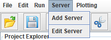
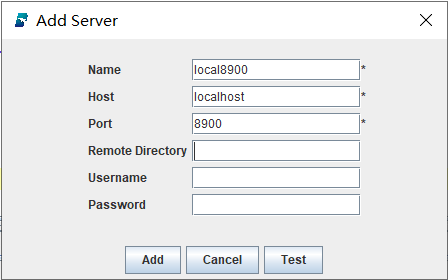
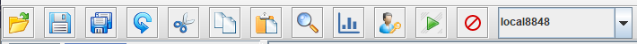
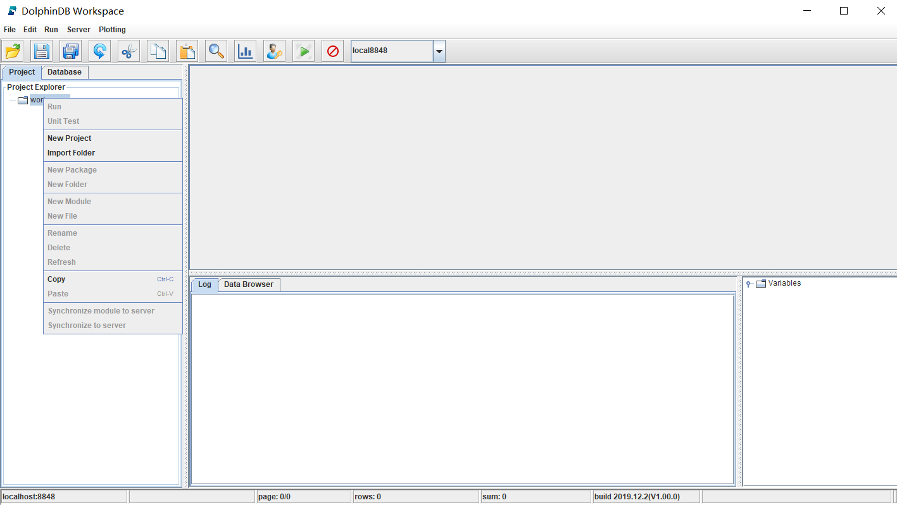
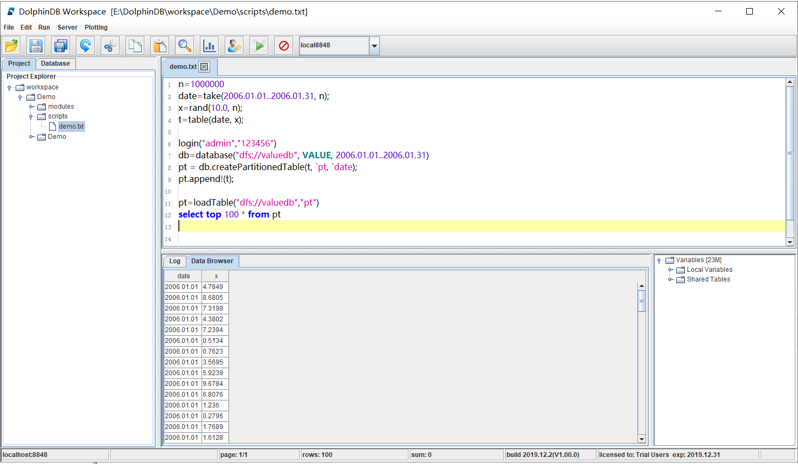

# 单节点部署

在单节点运行DolphinDB，可以帮助用户快速上手DolphinDB。用户只需下载DolphinDB程序包，下载地址：[http://www.dolphindb.cn/downloads.html](http://www.dolphindb.cn/downloads.html)

解压缩程序包，例如解压到如下目录：

```sh
/DolphinDB
```

> 请注意：安装路径的目录名中不能含有空格字符或中文字符，否则启动数据节点时会失败。例如不要装到Windows系统的Program Files目录下。

## 1. 软件授权许可更新

如果用户拿到企业版试用授权许可，只需用其替换如下文件即可。

```sh
/DolphinDB/server/dolphindb.lic
```

如果用户没有申请企业版试用授权许可，可以直接使用程序包中的社区版试用授权许可。社区试用版指定DolphinDB单节点最大可用内存为8GB，有效期为20年。

## 2. 运行DolphinDB Server

进入server目录 /DolphinDB/server/，

- Linux系统

在Linux环境中运行DolphinDB可执行文件前，需要修改文件权限：
```sh
chmod +x dolphindb
```

然后执行以下指令：
```sh
./dolphindb
```

如果要在Linux后台运行DolphinDB，可执行以下指令：
```sh
nohup ./dolphindb -console 0 &
```

建议通过Linux命令nohup（头）和 &（尾）启动为后台运行模式，这样即使终端失去连接，DolphinDB也会持续运行。

`-console`默认是为 1，如果要设置为后台运行，必须要设置为0（`-console 0`)，否则系统运行一段时间后会自动退出。

如果在Linux前台运行DolphinDB，可以通过命令行来执行DolphinDB代码；如果在Linux后台运行DolphinDB，不能通过命令行来执行DolphinDB代码，可以通过[GUI](http://www.dolphindb.cn/cn/gui/GUIGetStarted.html) 或[VS code插件](../插件/vscode_extension.md)等图形用户界面来执行代码。

- Windows系统

在Windows环境中只需双击运行dolphindb.exe。

系统默认端口号是8848。如果需要指定其它端口（例如，8900）可以通过如下命令行：

- Linux系统：

```sh
./dolphindb -localSite localhost:8900:local8900
```

- Windows系统：

```sh
dolphindb.exe -localSite localhost:8900:local8900
```

软件授权书dolphindb.lic指定DolphinDB可用的最大内存，用户也可以根据实际情况来调低该值。最大内存限制由配置参数maxMemSize（单位是GB）指定，我们可以在启动DolphinDB时指定该参数：

- Linux系统：

```sh
./dolphindb -localSite localhost:8900:local8900 -maxMemSize 32
```

- Windows系统：

```sh
dolphindb.exe -localSite localhost:8900:local8900 -maxMemSize 32
```

## 3. DolphinDB GUI连接DolphinDB Server

### 3.1 下载 GUI

下载地址：[http://www.dolphindb.cn/downloads.html](http://www.dolphindb.cn/downloads.html)

解压缩程序包，例如解压到如下目录：

```sh
/DolphinDB_GUI
```

### 3.2 启动GUI

Linux环境中，执行以下指令以启动GUI：
```sh
sh gui.sh
```
Windows环境中，双击 gui.bat 以启动GUI。

如果DolphinDB GUI无法正常启动，可能有以下两个原因：

(1) 没有安装Java。

(2) 安装的Java版本不符合要求。DolphinDB GUI使用环境需要Java 8或以上版本，请在[Java官网](https://www.oracle.com/technetwork/java/javase/downloads/index.html)下载符合要求的版本。

### 3.3 启动GUI后的操作

根据提示，选择一个文件夹作为工作区。

点击菜单栏中的Server添加服务器或编辑服务器：





在工具栏的右侧是一个下拉窗口，可以切换服务器：



## 4. 通过DolphinDB GUI运行DolphinDB脚本

在DolphinDB GUI视窗左侧项目导航栏，右键单击workspace，选择New Project新建项目，例如：Demo。



单击新建的项目左方的圆点以展开文件夹，右键单击scripts目录，并选择New File，输入新建脚本文件名，例如：demo.txt。

现在即可编写DolphinDB代码。在编辑器窗口输入以下DolphinDB代码：
```txt
n=1000000
date=take(2006.01.01..2006.01.31, n);
x=rand(10.0, n);
t=table(date, x);

login("admin","123456")
db=database("dfs://valuedb", VALUE, 2006.01.01..2006.01.31)
pt = db.createPartitionedTable(t, `pt, `date);
pt.append!(t);

pt=loadTable("dfs://valuedb","pt")
select top 100 * from pt
```

点击工具栏中的  按钮以运行脚本。下图展示了运行结果：



默认情况下，数据文件保存在DolphinDB部署包/server/local8848目录下。若需要修改保存数据文件的目录，可设置volumes配置参数。

> 注意：
> 1. 从V0.98版本开始，DolphinDB单实例支持分布式数据库。
> 2. DolphinDB GUI中的会话在用户关闭之前会一直存在。

## 5. 修改配置

修改单节点的配置参数有以下两种方式：

- 修改配置文件dolphindb.cfg。

- 在命令行中启动节点时指定配置参数。例如，启动节点时指定端口号为8900，最大内存为8GB：

Linux系统：
```sh
./dolphindb -localSite localhost:8900:local8900 -maxMemSize 8
```

Windows系统：
```sh
dolphindb.exe -localSite localhost:8900:local8900 -maxMemSize 8
```

更多DolphinDB配置参数请查看[单实例配置](https://www.dolphindb.cn/cn/help/DatabaseandDistributedComputing/Configuration/StandaloneMode.html)。

## 6. server版本升级

1. 正常关闭单节点。

2. 备份旧版本的元数据文件。单节点元数据的默认存储目录：

   ```sh
   /DolphinDB/server/local8900/dfsMeta/
   ```
   ```sh
   /DolphinDB/server/local8900/storage/CHUNK_METADATA/
   ```
   在linux上可在server目录执行以下命令备份单节点元数据：
   ```sh
   mkdir backup
   cp -r local8900/dfsMeta/ backup/dfsMeta
   cp -r local8900/storage/CHUNK_METADATA/ backup/CHUNK_METADATA
   ```
   
>  注意元数据文件可能通过配置文件指定存储在其它目录，如果在默认路径没有找到上述文件，可以通过查询配置文件中的dfsMetaDir参数和chunkMetaDir参数确认元数据文件的存储目录。若配置中未指定dfsMetaDir参数和chunkMetaDir参数，但是配置了volumes参数，CHUNK_METADATA目录在相应的volumes参数指定的目录下。

3. 下载需要更新版本的安装包。可以通过官网（[www.dolphindb.cn](http://www.dolphindb.cn/)）下载，在linux上可通过执行以下命令下载1.30.6版本的安装包： 

   ```sh
   wget https://www.dolphindb.cn/downloads/DolphinDB_Linux64_V1.30.6.zip
   ```

>  注意：上述命令中不同版本的号会有不同的文件名。

4. 解压。在linux上可通过执行以下命令解压1.30.6版本的安装包至v1.30.6目录：

   ```sh
   unzip DolphinDB_Linux64_V1.30.6.zip -d v1.30.6
   ```

5. 拷贝解压后的server子目录下文件除config目录、data目录、log目录和dolphindb.cfg外的所有文件和子目录到旧版本安装目录server下覆盖同名文件。

>  注意若有在旧版本的系统初始化脚本dolphindb.dos中添加脚本，请不要覆盖。旧版本的dolphindb.lic若是企业版license，也不要覆盖。

6. 重新启动单节点，GUI连接该节点，执行以下命令查看版本信息，检查升级是否成功：

   ```sh
   version()
   ```

## 7. 更多详细信息，请参阅DolphinDB帮助文档

- [中文](https://www.dolphindb.cn/cn/help/index.html)
- [英文](http://dolphindb.com/help/)