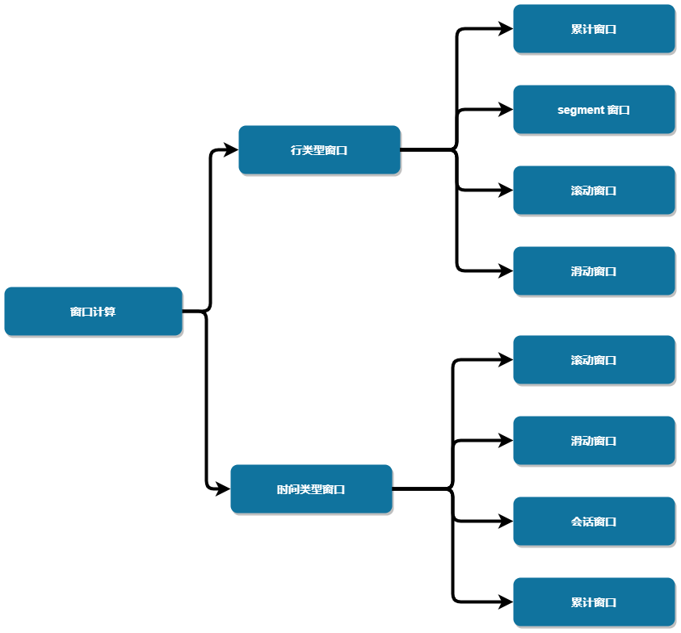
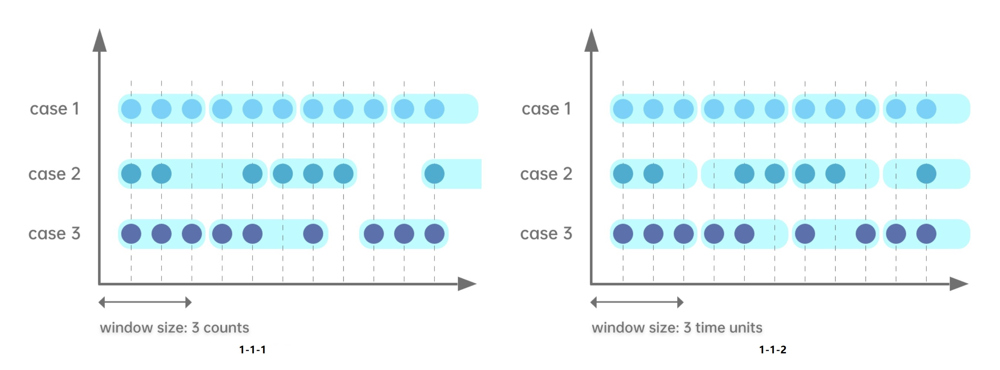
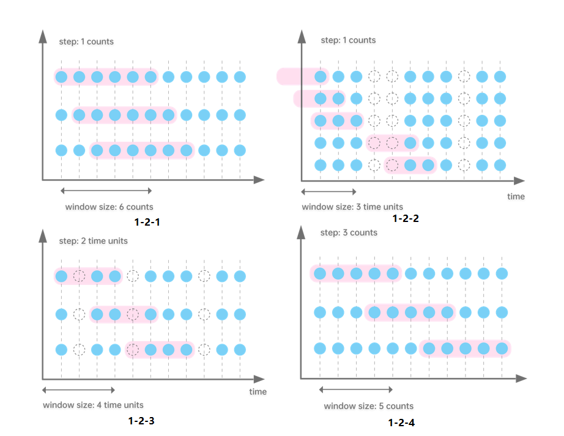
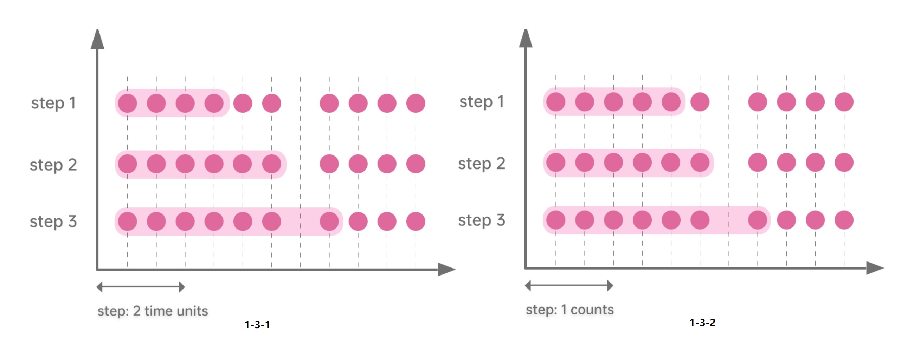
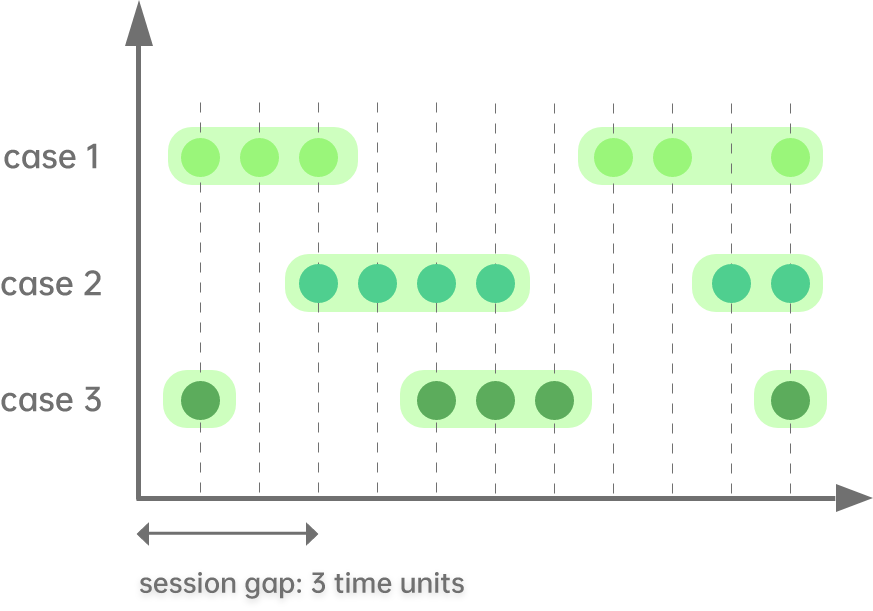
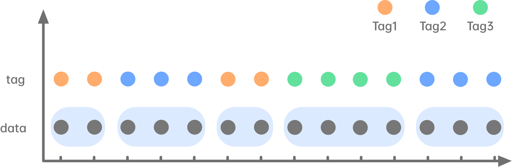

# DolphinDB窗口计算综述

在时序数据的处理中经常需要使用窗口计算。在DolphinDB中，窗口计算不仅仅应用于全量的历史数据计算，还可以应用于增量的流计算。窗口函数既可应用于SQL（处理表中的列），也可应用于面板数据（处理矩阵中的列）。DolphinDB对于窗口计算进行了精心优化，与其它系统相比，拥有显著的性能优势。除此之外，DolphinDB的窗口函数使用上更加灵活，不仅内置的或自定义的vector函数都可用于窗口计算，而且可以多个函数嵌套使用。

本篇将系统的介绍DolphinDB的窗口计算，从概念划分、应用场景、指标计算等角度，帮助用户快速掌握和运用DolphinDB强大的窗口计算功能。

本篇所有代码支持DolphinDB 1.30.15，2.00.3及以上版本。

1.30.7，2.00.0以上版本支持绝大部分代码，细节部分会在小节内部详细说明。

- [1. 窗口的概念及分类](#1-%E7%AA%97%E5%8F%A3%E7%9A%84%E6%A6%82%E5%BF%B5%E5%8F%8A%E5%88%86%E7%B1%BB)
  - [1.1 滚动窗口](#11-%E6%BB%9A%E5%8A%A8%E7%AA%97%E5%8F%A3)
  - [1.2 滑动窗口](#12-%E6%BB%91%E5%8A%A8%E7%AA%97%E5%8F%A3)
  - [1.3 累计窗口](#13-%E7%B4%AF%E8%AE%A1%E7%AA%97%E5%8F%A3)
  - [1.4 不定长窗口](#14-%E4%B8%8D%E5%AE%9A%E9%95%BF%E7%AA%97%E5%8F%A3)
    - [1.4.1 会话窗口](#141-%E4%BC%9A%E8%AF%9D%E7%AA%97%E5%8F%A3)
    - [1.4.2 segment窗口](#142-segment%E7%AA%97%E5%8F%A3)
- [2. SQL中的窗口计算以及窗口连接计算](#2-sql%E4%B8%AD%E7%9A%84%E7%AA%97%E5%8F%A3%E8%AE%A1%E7%AE%97%E4%BB%A5%E5%8F%8A%E7%AA%97%E5%8F%A3%E8%BF%9E%E6%8E%A5%E8%AE%A1%E7%AE%97)
  - [2.1 SQL中的窗口计算](#21-sql%E4%B8%AD%E7%9A%84%E7%AA%97%E5%8F%A3%E8%AE%A1%E7%AE%97)
    - [2.1.1 滚动窗口](#211-%E6%BB%9A%E5%8A%A8%E7%AA%97%E5%8F%A3)
      - [2.1.1.1 时间维度的滚动窗口](#2111-%E6%97%B6%E9%97%B4%E7%BB%B4%E5%BA%A6%E7%9A%84%E6%BB%9A%E5%8A%A8%E7%AA%97%E5%8F%A3)
      - [2.1.1.2 记录数维度的滚动窗口](#2112-%E8%AE%B0%E5%BD%95%E6%95%B0%E7%BB%B4%E5%BA%A6%E7%9A%84%E6%BB%9A%E5%8A%A8%E7%AA%97%E5%8F%A3)
    - [2.1.2 滑动窗口](#212-%E6%BB%91%E5%8A%A8%E7%AA%97%E5%8F%A3)
      - [2.1.2.1 步长为1行，窗口长度为n行](#2121-%E6%AD%A5%E9%95%BF%E4%B8%BA1%E8%A1%8C%E7%AA%97%E5%8F%A3%E9%95%BF%E5%BA%A6%E4%B8%BAn%E8%A1%8C)
      - [2.1.2.2 步长为1行，窗口为指定时间长度](#2122-%E6%AD%A5%E9%95%BF%E4%B8%BA1%E8%A1%8C%E7%AA%97%E5%8F%A3%E4%B8%BA%E6%8C%87%E5%AE%9A%E6%97%B6%E9%97%B4%E9%95%BF%E5%BA%A6)
      - [2.1.2.3 步长为时间长度，窗口为n个步长时间](#2123-%E6%AD%A5%E9%95%BF%E4%B8%BA%E6%97%B6%E9%97%B4%E9%95%BF%E5%BA%A6%E7%AA%97%E5%8F%A3%E4%B8%BAn%E4%B8%AA%E6%AD%A5%E9%95%BF%E6%97%B6%E9%97%B4)
      - [2.1.2.4 步长为n行，窗口为k*n行](#2124-%E6%AD%A5%E9%95%BF%E4%B8%BAn%E8%A1%8C%E7%AA%97%E5%8F%A3%E4%B8%BAkn%E8%A1%8C)
    - [2.1.3 累计窗口](#213-%E7%B4%AF%E8%AE%A1%E7%AA%97%E5%8F%A3)
      - [2.1.3.1 步长为1行](#2131-%E6%AD%A5%E9%95%BF%E4%B8%BA1%E8%A1%8C)
      - [2.1.3.2 步长为指定时间长度](#2132-%E6%AD%A5%E9%95%BF%E4%B8%BA%E6%8C%87%E5%AE%9A%E6%97%B6%E9%97%B4%E9%95%BF%E5%BA%A6)
    - [2.1.4 segment窗口](#214-segment%E7%AA%97%E5%8F%A3)
  - [2.2 SQL中的窗口连接计算](#22-sql%E4%B8%AD%E7%9A%84%E7%AA%97%E5%8F%A3%E8%BF%9E%E6%8E%A5%E8%AE%A1%E7%AE%97)
- [3.面板数据使用窗口计算](#3%E9%9D%A2%E6%9D%BF%E6%95%B0%E6%8D%AE%E4%BD%BF%E7%94%A8%E7%AA%97%E5%8F%A3%E8%AE%A1%E7%AE%97)
  - [3.1 面板数据的滑动窗口计算](#31-%E9%9D%A2%E6%9D%BF%E6%95%B0%E6%8D%AE%E7%9A%84%E6%BB%91%E5%8A%A8%E7%AA%97%E5%8F%A3%E8%AE%A1%E7%AE%97)
    - [3.1.1 步长为1行，窗口为n行](#311-%E6%AD%A5%E9%95%BF%E4%B8%BA1%E8%A1%8C%E7%AA%97%E5%8F%A3%E4%B8%BAn%E8%A1%8C)
    - [3.1.2 步长为1行，窗口为指定时间](#312-%E6%AD%A5%E9%95%BF%E4%B8%BA1%E8%A1%8C%E7%AA%97%E5%8F%A3%E4%B8%BA%E6%8C%87%E5%AE%9A%E6%97%B6%E9%97%B4)
  - [3.2 面板数据的累计窗口计算](#32-%E9%9D%A2%E6%9D%BF%E6%95%B0%E6%8D%AE%E7%9A%84%E7%B4%AF%E8%AE%A1%E7%AA%97%E5%8F%A3%E8%AE%A1%E7%AE%97)
  <!-- - [3.3 面板数据的聚合窗口计算](#33-%E9%9D%A2%E6%9D%BF%E6%95%B0%E6%8D%AE%E7%9A%84%E8%81%9A%E5%90%88%E7%AA%97%E5%8F%A3%E8%AE%A1%E7%AE%97) -->
- [4.流式数据的窗口计算](#4%E6%B5%81%E5%BC%8F%E6%95%B0%E6%8D%AE%E7%9A%84%E7%AA%97%E5%8F%A3%E8%AE%A1%E7%AE%97)
  - [4.1 滚动窗口在流计算中的应用](#41-%E6%BB%9A%E5%8A%A8%E7%AA%97%E5%8F%A3%E5%9C%A8%E6%B5%81%E8%AE%A1%E7%AE%97%E4%B8%AD%E7%9A%84%E5%BA%94%E7%94%A8)
  - [4.2 滑动、累计窗口在流计算中的应用](#42-%E6%BB%91%E5%8A%A8%E7%B4%AF%E8%AE%A1%E7%AA%97%E5%8F%A3%E5%9C%A8%E6%B5%81%E8%AE%A1%E7%AE%97%E4%B8%AD%E7%9A%84%E5%BA%94%E7%94%A8)
  - [4.3 会话窗口引擎](#43-%E4%BC%9A%E8%AF%9D%E7%AA%97%E5%8F%A3%E5%BC%95%E6%93%8E)
- [5.窗口计算的空值处理规则](#5%E7%AA%97%E5%8F%A3%E8%AE%A1%E7%AE%97%E7%9A%84%E7%A9%BA%E5%80%BC%E5%A4%84%E7%90%86%E8%A7%84%E5%88%99)
  - [5.1 moving，m系列函数，tm系列函数以及cum系列函数的空值处理](#51-movingm%E7%B3%BB%E5%88%97%E5%87%BD%E6%95%B0tm%E7%B3%BB%E5%88%97%E5%87%BD%E6%95%B0%E4%BB%A5%E5%8F%8Acum%E7%B3%BB%E5%88%97%E5%87%BD%E6%95%B0%E7%9A%84%E7%A9%BA%E5%80%BC%E5%A4%84%E7%90%86)
  - [5.2 rolling的空值处理](#52-rolling%E7%9A%84%E7%A9%BA%E5%80%BC%E5%A4%84%E7%90%86)
- [6. 常用指标的计算复杂度](#6-%E5%B8%B8%E7%94%A8%E6%8C%87%E6%A0%87%E7%9A%84%E8%AE%A1%E7%AE%97%E5%A4%8D%E6%9D%82%E5%BA%A6)
- [7. 涉及到窗口计算的函数](#7-%E6%B6%89%E5%8F%8A%E5%88%B0%E7%AA%97%E5%8F%A3%E8%AE%A1%E7%AE%97%E7%9A%84%E5%87%BD%E6%95%B0)
- [8. 总结](#8-%E6%80%BB%E7%BB%93)


## 1. 窗口的概念及分类

DolphinDB内有四种窗口，分别是：滚动窗口、滑动窗口、累计窗口和不定长窗口（包括会话窗口和segment window）。

在DolphinDB中，窗口的度量标准有两种：数据行数和时间。
为了方便理解，可以参考下图：


<!--     -->

<!---在DolphinDB中，窗口的运用也非常的广泛，不仅可以用于历史数据，包括纵表和宽表，还可以运用在实时计算中。功能非常强大，几乎所有的场景都会涉及。--->


本章节将介绍各个窗口类型的概念，具体的应用实例会在第2-4章节详细介绍。

### 1.1 滚动窗口

滚动窗口将每个数据分配到一个指定大小的窗口中。通常滚动窗口大小固定，且相邻两个窗口没有重复的元素。

滚动窗口根据度量标准的不同可以分为2种：

* **以行数划分窗口**

图1-1-1 指定窗口大小为3行记录，横坐标以时间为单位。从图上可以看出，按每三行记录划分为了一个窗口，窗口之间的元素没有重叠。  

* **以时间划分窗口**

图1-1-2 指定窗口大小为3个时间单位，横坐标以时间为单位。与以行数划分窗口不同，按时间划分的窗口内记录数是不固定的。从两个图中可以看出，同一数据按不同单位类型划分窗口的结果是不同的。



### 1.2 滑动窗口

滑动窗口的模式是：一定长度的窗口，根据步长，进行滑动。与滚动窗口不同，滑动窗口相邻两个窗口可能包括重复的元素。滑动窗口根据步长和窗口采用不同的度量标准，可以分成以下4种：

* **步长为1行, 窗口为n行**

图1-2-1 指定窗口大小为6行记录，窗口每次向后滑动1行记录。

* **步长为1行，窗口为指定时间**

图1-2-2 指定窗口大小为3个时间单位，窗口以右边界为基准进行前向计算，窗口每次向后滑动1行记录。

* **步长为时间，窗口为n个步长时间**

图1-2-3 指定窗口大小为4个时间单位，每次向后滑动2个时间单位。

* **步长为n行，窗口为m行**

图1-2-4 指定窗口大小为5行记录，窗口每次向后滑动3行记录。




### 1.3 累计窗口

累计窗口，即窗口的起始边界固定，结束边界累计右移。根据数据的增加或时间的增长，窗口的大小会变大。
累计窗口根据度量标准的不同可以分为2种：

* **步长为指定时间单位**

图1-3-1 窗口右边界每次右移2个时间单位，窗口大小累计增加。

* **步长为1行**

图1-3-2 窗口右边界每次右移1行，窗口大小累计增加。


<!--     -->

### 1.4 不定长窗口

#### 1.4.1 会话窗口

会话窗口是根据指定时间长度（session gap）切分窗口：若某条数据之后指定时间长度内无数据进入，则该条数据为一个窗口的终点，之后第一条新数据为另一个窗口的起点。
会话窗口的窗口大小可变，窗口的度量方式为时间。



#### 1.4.2 segment窗口

segment窗口是根据给定的数据来切分窗口，连续的相同元素为一个窗口。窗口大小可变，窗口的度量方式为行。



## 2. SQL中的窗口计算以及窗口连接计算

SQL中的窗口计算一般涉及滚动窗口，滑动窗口，累计窗口以及segment窗口。DolphinDB中也有涉及窗口计算的window join窗口连接。本章将对上述几个窗口计算一一介绍。

### 2.1 SQL中的窗口计算

#### 2.1.1 滚动窗口

##### 2.1.1.1 时间维度的滚动窗口

在SQL中，可使用```interval```, ```bar```, ```dailyAlignedBar```等函数配合```group by```语句实现滚动窗口的聚合计算。

以```bar```函数为例，下面的例子是将10:00:00到10:05:59每秒更新的数据，每2分钟统计一次交易量之和：

```
t=table(2021.11.01T10:00:00..2021.11.01T10:05:59 as time, 1..360 as volume)
select sum(volume) from t group by bar(time, 2m)

# output

bar_time            sum_volume
------------------- ----------
2021.11.01T10:00:00 7260      
2021.11.01T10:02:00 21660     
2021.11.01T10:04:00 36060  
```

```bar```函数的分组规则是根据每条记录最近的能整除duration参数的时间作为开始时间的，但是对于一些开始时间不能直接被整除的场景，```bar```函数不适用。
在金融场景中，往往在交易时段之外也有一些数据输入，但是在做数据分析的时候并不会用到这些数据；在期货市场，通常涉及到两个时间段，有些交易时段会隔天。```dailyAlignedBar```函数可以设置每天的起始时间和结束时间，很好地解决这类场景的聚合计算问题。

以期货市场为例，数据模拟为国内期货市场两天的两个交易时段下午1:30-3:00和晚上9:00-凌晨2:30。使用```dailyAlignedBar```函数计算每个交易时段中的7分钟均价。


```
sessions = 13:30:00 21:00:00
ts = 2021.11.01T13:30:00..2021.11.01T15:00:00 join 2021.11.01T21:00:00..2021.11.02T02:30:00
ts = ts join (ts+60*60*24)
t = table(ts, rand(10.0, size(ts)) as price)

select avg(price) as price, count(*) as count from t group by dailyAlignedBar(ts, sessions, 7m) as k7

 # output
 
k7                  price             count
------------------- ----------------- -----
2021.11.01T13:30:00 4.815287529108381 420  
2021.11.01T13:37:00 5.265409774828835 420  
2021.11.01T13:44:00 4.984934388122167 420  
...
2021.11.01T14:47:00 5.031795592230213 420  
2021.11.01T14:54:00 5.201864532018313 361  
2021.11.01T21:00:00 4.945093814017518 420 


//如果使用bar函数会不达预期
select avg(price) as price, count(*) as count from t group by bar(ts, 7m) as k7

 # output

k7                  price             count
------------------- ----------------- -----
2021.11.01T13:26:00 5.220721067537347 180       //时间从13:26:00开始，不符合预期
2021.11.01T13:33:00 4.836406542137931 420  
2021.11.01T13:40:00 5.100716347573325 420  
2021.11.01T13:47:00 5.041169475132067 420  
2021.11.01T13:54:00 4.853431270784876 420  
2021.11.01T14:01:00 4.826169502311608 420  
 ```

```interval```函数的主要应用是插值。如期货市场中有一些不活跃的期货，一段时间内可能都没有报价，但是在数据分析的时候需要每2秒都需要输出该期货的数据，缺失的数据根据前面的值进行插值；如果这2秒内有重复的值，则用最后一个作为输出值。这个场景下就需要用到```interval```函数。

```
t=table(2021.01.01T01:00:00+(1..5 join 9..11) as time, take(`CLF1,8) as contract, 50..57 as price)

select last(contract) as contract, last(price) as price from t group by interval(time, 2s,"prev") 

 # output

interval_time       contract price
------------------- -------- -----
2021.01.01T01:00:00 CLF1     50   
2021.01.01T01:00:02 CLF1     52   
2021.01.01T01:00:04 CLF1     54   
2021.01.01T01:00:06 CLF1     54   
2021.01.01T01:00:08 CLF1     55   
2021.01.01T01:00:10 CLF1     57   

//如果使用bar函数会不达预期

select last(contract) as contract, last(price) as price from t group by bar(time, 2s)

bar_time            contract price
------------------- -------- -----
2021.01.01T01:00:00 CLF1     50   
2021.01.01T01:00:02 CLF1     52   
2021.01.01T01:00:04 CLF1     54   
2021.01.01T01:00:08 CLF1     55   
2021.01.01T01:00:10 CLF1     57    
 ```

##### 2.1.1.2 记录数维度的滚动窗口

除了时间维度可以做滚动窗口计算之外，记录数维度也可以做滚动窗口计算。
在股票市场临近收盘的时候，往往一分钟之内的交易量、笔数是非常大的，做策略时如果单从时间维度去触发可能会导致偏差。因此分析师有时会想要从每100笔交易而非每一分钟的角度去做策略，这个时候就可以用```rolling```函数实现。

下面是某天股票市场最后一分钟内对每100笔交易做成交量之和的例子：

```
t=table(2021.01.05T02:59:00.000+(1..2000)*100 as time, take(`CL,2000) as sym, 10* rand(50, 2000) as vol)

select rolling(last,time,100) as last_time,rolling(last,t.sym,100) as sym, rolling(sum,vol,100) as vol_100_sum from t 

 # output (每次结果会因为rand函数结果而不同)

last_time               sym vol_100_sum
----------------------- --- -----------
2021.01.05T02:59:00.100 CL  26480      
2021.01.05T02:59:00.200 CL  25250      
2021.01.05T02:59:00.300 CL  25910      
2021.01.05T02:59:00.400 CL  22890      
2021.01.05T02:59:00.500 CL  24000      
...   
 ```

#### 2.1.2 滑动窗口

滑动窗口计算涉及步长与窗口长度两个维度：

* 步长是指计算如何触发：每隔一定数量的行或者每隔一定时间长度；
* 窗口长度是指每次计算时包含的数据量：一定数量的行的数据或者一定时间长度的数据。

##### 2.1.2.1 步长为1行，窗口长度为n行

此类情况可使用m系列函数，`moving`函数，或者`rolling`。下面以[````msum````](https://www.dolphindb.cn/cn/help/130/FunctionsandCommands/FunctionReferences/m/msum.html)为例，滑动计算窗口长度为5行的vol值之和。

```
t=table(2021.11.01T10:00:00 + 0 1 2 5 6 9 10 17 18 30 as time, 1..10 as vol)

select time, vol, msum(vol,5,1) from t

 # output

time                vol msum_vol
------------------- --- --------
2021.11.01T10:00:00 1   1       
2021.11.01T10:00:01 2   3       
2021.11.01T10:00:02 3   6       
2021.11.01T10:00:05 4   10      
2021.11.01T10:00:06 5   15    
...
 ```

DolphinDB SQL可以通过```context by```对各个不同的symbol在组内进行窗口计算。```context by```是DolphinDB独有的功能，是对标准SQL语句的拓展，具体其他用法参照：[```context by```](https://www.dolphindb.cn/cn/help/130/SQLStatements/contextBy.html)

```
t=table(2021.11.01T10:00:00 + 0 1 2 5 6 9 10 17 18 30 join 0 1 2 5 6 9 10 17 18 30 as time, 1..20 as vol, take(`A,10) join take(`B,10) as sym)

select time, sym, vol, msum(vol,5,1) from t context by sym

 # output

time                sym vol msum_vol
------------------- --- --- --------
2021.11.01T10:00:00 A   1   1       
2021.11.01T10:00:01 A   2   3       
2021.11.01T10:00:02 A   3   6       
...    
2021.11.01T10:00:30 A   10  40      
2021.11.01T10:00:00 B   11  11      
2021.11.01T10:00:01 B   12  23      
...    
2021.11.01T10:00:30 B   20  90 
 ```

m系列函数是经过优化的窗口函数，如果想要使用自定义函数做窗口计算，DolphinDB支持在```moving```函数和```rolling```函数中使用自定义聚合函数。下面以```moving```嵌套自定义聚合函数为例：
以下的行情数据有四列(代码，日期，close和volume)，按照代码分组，组内按日期排序。设定窗口大小为20，在窗口期内按照volume排序，取volume最大的五条数据的平均close的计算。

```
//t是模拟的四列数据
t = table(take(`IBM, 100) as code, 2020.01.01 + 1..100 as date, rand(100,100) + 20 as volume, rand(10,100) + 100.0 as close)

//1.30.15及以上版本可以用一行代码实现
//moving支持用户使用自定义匿名聚合函数(https://www.dolphindb.cn/cn/help/130/Functionalprogramming/AnonymousFunction.html)
select code, date, moving(defg(vol, close){return close[isort(vol, false).subarray(0:min(5,close.size()))].avg()}, (volume, close), 20) from t context by code 

//其他版本可以用自定义命名聚合函数实现：
defg top_5_close(vol,close){
return close[isort(vol, false).subarray(0:min(5,close.size()))].avg()
}
select code, date, moving(top_5_close,(volume, close), 20) from t context by code 
 ```

在做数据分析的时候，还会经常用到窗口嵌套窗口的操作。
举一个更复杂的例子：在做 [101 Formulaic Alphas](https://arxiv.org/ftp/arxiv/papers/1601/1601.00991.pdf)中98号因子计算的时候，DolphinDB可以运用窗口嵌套窗口的方法，将原本在C#中需要几百行的代码，简化成几行代码，且计算性能也有接近三个数量级的提升。
trade表有需要可以自行模拟数据，或用sample数据[CNTRADE](../data/window_cal/CNTRADE.csv)。

```
// 输入表trade的schema如下，如需要可自行模拟数据。

name       typeString typeInt 
---------- ---------- ------- 
ts_code    SYMBOL     17             
trade_date DATE       6              
open       DOUBLE     16             
vol        DOUBLE     16             
amount     DOUBLE     16    

// alpha 98 计算：

def normRank(x){
	return rank(x)\x.size()
}

def alpha98SQL(t){
	update t set adv5 = mavg(vol, 5), adv15 = mavg(vol, 15) context by ts_code
	update t set rank_open = normRank(open), rank_adv15 = normRank(adv15) context by trade_date
	update t set decay7 = mavg(mcorr(vwap, msum(adv5, 26), 5), 1..7), decay8 = mavg(mrank(9 - mimin(mcorr(rank_open, rank_adv15, 21), 9), true, 7), 1..8) context by ts_code
	return select ts_code, trade_date, normRank(decay7)-normRank(decay8) as a98 from t context by trade_date 
}

input = select trade_date,ts_code,amount*1000/(vol*100 + 1) as vwap,vol,open from trade
timer alpha98DDBSql = alpha98SQL(input)
 ```

##### 2.1.2.2 步长为1行，窗口为指定时间长度

此类情况可使用m系列或者tm系列函数。下面以```tmsum```为例，计算滑动窗口长度为5秒的vol值之和。

```
//1.30.14，2.00.2以上版本支持```tmsum```函数。
t=table(2021.11.01T10:00:00 + 0 1 2 5 6 9 10 17 18 30 as time, 1..10 as vol)
select time, vol, tmsum(time,vol,5s) from t

 # output
time                vol tmsum_time
------------------- --- ----------
2021.11.01T10:00:00 1   1         
2021.11.01T10:00:01 2   3         
2021.11.01T10:00:02 3   6         
2021.11.01T10:00:05 4   9         
2021.11.01T10:00:06 5   12        
2021.11.01T10:00:09 6   15        
2021.11.01T10:00:10 7   18        
2021.11.01T10:00:17 8   8         
2021.11.01T10:00:18 9   17        
2021.11.01T10:00:30 10  10  
 ```

实际场景中，计算历史分位的时候也会广泛运用到这类情况的窗口计算，具体在3.1.1介绍。

##### 2.1.2.3 步长为时间长度，窗口为n个步长时间

此类情况可使用```interval```函数配合```group by```语句。下面的例子以5秒为窗口步长，10秒为窗口大小，计算vol值之和。

推荐使用1.30.14, 2.00.2及以上版本使用interval函数。

```
t=table(2021.11.01T10:00:00+0 3 5 6 7 8 15 18 20 29 as time, 1..10 as vol)
select sum(vol) from t group by interval(time, 10s, "null", 5s)

 # output

interval_time       sum_vol
------------------- -------
2021.11.01T10:00:00 21     
2021.11.01T10:00:05 18     
2021.11.01T10:00:10 15       
2021.11.01T10:00:15 24     
2021.11.01T10:00:20 19     
2021.11.01T10:00:25 10    
 ```

2.1.1.1中interval的场景可以看作是窗口大小与步长相等的特殊的滑动窗口，而本节则是窗口大小为n倍步长时间的滑动窗口。```interval```函数为数据分析提供了更便捷的工具。


##### 2.1.2.4 步长为n行，窗口为k*n行

此类情况可使用高阶函数[`rolling`](https://www.dolphindb.cn/cn/help/130/Functionalprogramming/TemplateFunctions/rolling.html?highlight=rolling)。下面的例子计算步长为3行，窗口长度为6行的vol值之和。与```interval```函数不同的是，`rolling`不会对缺失值进行插值，如果窗口内的元素个数不足窗口大小，该窗口不会被输出。
该例子中，数据一共是10条，在前两个窗口计算完之后，第三个窗口因为只有4条数据，所以不输出第三个窗口的结果。

```
t=table(2021.11.01T10:00:00+0 3 5 6 7 8 15 18 20 29 as time, 1..10 as vol)
select rolling(last,time,6,3) as last_time, rolling(sum,vol,6,3) as sum_vol from t

 # output

last_time           sum_vol
------------------- -------
2021.11.01T10:00:08 21     
2021.11.01T10:00:20 39
 ```

#### 2.1.3 累计窗口

累计窗口有两种情况：一种是步长是1行，另一种是步长为指定时间长度。

##### 2.1.3.1 步长为1行

步长为1行的累计窗口计算在SQL中通常直接用```cum```系列函数。下面的是累计求和```cumsum```的例子：

```
t=table(2021.11.01T10:00:00..2021.11.01T10:00:04 join 2021.11.01T10:00:06..2021.11.01T10:00:10 as time,1..10 as vol)
select *, cumsum(vol) from t 

# output

time                vol cum_vol
------------------- --- -------
2021.11.01T10:00:00 1   1      
2021.11.01T10:00:01 2   3      
2021.11.01T10:00:02 3   6      
2021.11.01T10:00:03 4   10     
2021.11.01T10:00:04 5   15     
2021.11.01T10:00:06 6   21     
2021.11.01T10:00:07 7   28     
2021.11.01T10:00:08 8   36     
2021.11.01T10:00:09 9   45     
2021.11.01T10:00:10 10  55     
 ```

在实际场景中经常会用cum系列函数与```context by```连用，做分组内累计计算。比如行情数据中，根据各个不同股票的代码，做各自的累计成交量。

```
t=table(2021.11.01T10:00:00 + 0 1 2 5 6 9 10 17 18 30 join 0 1 2 5 6 9 10 17 18 30 as time, 1..20 as vol, take(`A,10) join take(`B,10) as sym)
select*, cumsum(vol) as cumsum_vol from t context by sym

# output

time                vol sym cumsum_vol
------------------- --- --- ----------
2021.11.01T10:00:00 1   A   1         
2021.11.01T10:00:01 2   A   3         
...      
2021.11.01T10:00:18 9   A   45        
2021.11.01T10:00:30 10  A   55        
2021.11.01T10:00:00 11  B   11        
2021.11.01T10:00:01 12  B   23        
...      
2021.11.01T10:00:18 19  B   135       
2021.11.01T10:00:30 20  B   155       
 ```

##### 2.1.3.2 步长为指定时间长度

要在SQL中实现步长为指定时间长度的累计窗口计算，可以使用```bar```类函数搭配```cgroup```来实现。

```
t=table(2021.11.01T10:00:00..2021.11.01T10:00:04 join 2021.11.01T10:00:06..2021.11.01T10:00:10 as time,1..10 as vol)
select sum(vol) from t cgroup by bar(time, 5s) as time order by time

# output

time                sum_vol
------------------- -------
2021.11.01T10:00:00 15     
2021.11.01T10:00:05 45     
2021.11.01T10:00:10 55  
 ```

#### 2.1.4 segment窗口

以上所有例子中，窗口大小均固定。在DolphinDB中亦可将连续的相同元素做为一个窗口，用```segment```来实现。下面的例子是根据order_type中的数据进行窗口分割，进行累计求和计算。
实际场景中，```segment```经常用于逐笔数据中，连续相同的order_type做累计成交额。

```
vol = 0.1 0.2 0.1 0.2 0.1 0.2 0.1 0.2 0.1 0.2 0.1 0.2
order_type = 0 0 1 1 1 2 2 1 1 3 3 2;
t = table(vol,order_type);
select *, cumsum(vol) as cumsum_vol from t context by segment(order_type);

# output

vol order_type cumsum_vol
--- ---------- ----------
0.1 0          0.1       
0.2 0          0.3       
0.1 1          0.1       
0.2 1          0.3       
0.1 1          0.4       
0.2 2          0.2       
0.1 2          0.3       
0.2 1          0.2       
0.1 1          0.3       
0.2 3          0.2       
0.1 3          0.3       
0.2 2          0.2       
 ```

### 2.2 SQL中的窗口连接计算

在DolphinDB中，除了常规的窗口计算之外，还支持窗口连接计算。即在表连接的同时，进行窗口计算。这里用到的函数有```wj```和```pwj```。

window join在表连接的同时对右表进行步长为1行，窗口为时间长度的窗口计算。因为窗口的左右边界均可以指定，也可以为负数，所以也可以看作非常灵活的滑动窗口。详细用法参见用户手册[`window join`](https://www.dolphindb.cn/cn/help/130/SQLStatements/TableJoiners/windowjoin.html?highlight=window)。

```
//data
t1 = table(1 1 2 as sym, 09:56:06 09:56:07 09:56:06 as time, 10.6 10.7 20.6 as price)
t2 = table(take(1,10) join take(2,10) as sym, take(09:56:00+1..10,20) as time, (10+(1..10)\10-0.05) join (20+(1..10)\10-0.05) as bid, (10+(1..10)\10+0.05) join (20+(1..10)\10+0.05) as offer, take(100 300 800 200 600, 20) as volume);

//window join calculation
wj(t1, t2, -5s:0s, <avg(bid)>, `sym`time);

# output

sym time     price  avg_bid           
--- -------- ----- -------
1   09:56:06 10.6 10.3
1   09:56:07 10.7 10.4
2   09:56:06 20.6 20.3        
```


由于窗口可以灵活设置，所以不仅是多表连接的时候会用到，单表内部的窗口计算也可以用到window join。下面的例子可以看作是t2表中每一条数据做一个(time-6s)到(time+1s)的计算。

```
t2 = table(take(1,10) join take(2,10) as sym, take(09:56:00+1..10,20) as time, (10+(1..10)\10-0.05) join (20+(1..10)\10-0.05) as bid, (10+(1..10)\10+0.05) join (20+(1..10)\10+0.05) as offer, take(100 300 800 200 600, 20) as volume);

wj(t2, t2, -6s:1s, <avg(bid)>, `sym`time);

# output

sym time     bid   offer volume avg_bid           
--- -------- ---- ------ ------ --------
1   09:56:01 10.05 10.15 100    10.1
...  
1   09:56:08 10.75 10.85 800    10.5              
1   09:56:09 10.85 10.95 200    10.6
1   09:56:10 10.95 11.05 600    10.65             
2   09:56:01 20.05 20.15 100    20.1
2   09:56:02 20.15 20.25 300    20.15
...
2   09:56:08 20.75 20.85 800    20.5              
2   09:56:09 20.85 20.9  200    20.6
2   09:56:10 20.95 21.05 600    20.65
```

## 3.面板数据使用窗口计算

在DolphinDB中，面板数据可以是矩阵也可以是表。表的窗口计算在前一章节已经描述，所以在这一章节中着重讨论矩阵的计算。

### 3.1 面板数据的滑动窗口计算

滑动窗口m系列函数也可以适用于面板数据，即在矩阵每列内进行计算，返回一个与输入矩阵维度相同的矩阵。如果滑动维度为时间，则要先使用[````setIndexedMatrix!````](https://www.dolphindb.cn/cn/help/130/FunctionsandCommands/FunctionReferences/s/setIndexedMatrix!.html?highlight=setindex)函数将矩阵的行与列标签设为索引。这里需要注意的是，行与列标签均须严格递增。在矩阵计算中，IndexedMatrix可以帮助对齐行与列的不同标签，非常实用。通常我们会使用```pivot by```语句配合```exec```或者```panel```函数将竖表转化为宽表（矩阵），因为这个操作会将矩阵的行与列按递增方式排列，方便我们设置索引矩阵以及后期的计算。

首先我们新建一个矩阵，并将其设为IndexedMatrix：

```
m=matrix(1..4 join 6, 11..13 join 8..9)
m.rename!(2020.01.01..2020.01.04 join 2020.01.06,`A`B)
m.setIndexedMatrix!();
```

面板数据的滑动窗口大小支持两种度量方式：记录数和时间。


#### 3.1.1 步长为1行，窗口为n行

m系列函数的参数可以是一个正整数（记录数维度）或一个 duration（时间维度）。通过设定不同的参数，可以指定理想的滑动窗口类型。

以```msum```滑动求和为例。以下例子是对一个矩阵内部，每一列做窗口大小为3行的滑动求和。

```
msum(m,3,1)

# output

           A  B 
           -- --
2020.01.01|1  11
2020.01.02|3  23
2020.01.03|6  36
2020.01.04|9  33
2020.01.06|13 30
```

矩阵运算中，也可以做复杂的窗口嵌套。曾在2.1.2.1节中提到的98号因子也可以在矩阵中通过几行代码实现(trade表有需要可以自行模拟数据，或用sample数据[CNTRADE](../data/window_cal/CNTRADE.csv))：

```
// 输入表trade的schema如下，如需要可自行模拟数据：

name       typeString typeInt 
---------- ---------- ------- 
ts_code    SYMBOL     17             
trade_date DATE       6              
open       DOUBLE     16             
vol        DOUBLE     16             
amount     DOUBLE     16   

// alpha 98 的矩阵计算

def prepareDataForDDBPanel(){
	t = select trade_date,ts_code,amount*1000/(vol*100 + 1) as vwap,vol,open from trade 
	return dict(`vwap`open`vol, panel(t.trade_date, t.ts_code, [t.vwap, t.open, t.vol]))
}

def myrank(x) {
	return rowRank(x)\x.columns()
}

def alpha98Panel(vwap, open, vol){
	return myrank(mavg(mcorr(vwap, msum(mavg(vol, 5), 26), 5), 1..7)) - myrank(mavg(mrank(9 - mimin(mcorr(myrank(open), myrank(mavg(vol, 15)), 21), 9), true, 7), 1..8))
}

input = prepareDataForDDBPanel()
alpha98DDBPanel = alpha98Panel(input.vwap, input.open, input.vol)
 ```

#### 3.1.2 步长为1行，窗口为指定时间

以```msum```滑动求和为例。以下例子是对一个矩阵内部，每一列根据左边的时间列做窗口大小为3天的滑动求和。

```
msum(m,3d)

# output

           A  B 
           -- --
2020.01.01|1  11
2020.01.02|3  23
2020.01.03|6  36
2020.01.04|9  33
2020.01.06|10 17
 ```

在实际运用中，这类矩阵窗口运算是非常常见的。比如在做历史分位的计算中，将数据转化为IndexedMatrix之后，直接用一行代码就可以得到结果了。

下面例子是对m矩阵做10年的历史分位计算：

```
//推荐使用1.30.14, 2.00.2及以上版本来使用interval函数。
mrank(m, true, 10y, percent=true)

# output
           A B   
           - ----
2020.01.01|1 1   
2020.01.02|1 1   
2020.01.03|1 1   
2020.01.04|1 0.25
2020.01.06|1 0.4 
 ```

### 3.2 面板数据的累计窗口计算

在面板数据中，累计函数```cum```系列也可以直接使用。
以```cumsum```为例：

```
cumsum(m)

 # output 

            A  B 
           -- --
2020.01.01|1  11
2020.01.02|3  23
2020.01.03|6  36
2020.01.04|10 44
2020.01.06|16 53
 ```

结果为在矩阵的每一列，计算累计和。

## 4.流式数据的窗口计算

在DolphindDB中，设计了许多内置的流计算引擎。各类引擎都有不同的用法，有些支持聚合计算，有些则支持滑动窗口或者累计窗口计算，在此基础上也有针对于流数据的会话窗口引擎。可以满足不同的场景需求。下面根据不同窗口以及引擎分别介绍。

### 4.1 滚动窗口在流计算中的应用

实际场景中，滚动窗口计算在流数据中应用得最为广泛。比如5分钟k线，1分钟累计交易量等等的应用，都需要用到滚动窗口计算。滚动窗口在流计算中的应用是通过各种时间序列引擎实现的。

```createTimeSeriesEngine```时间序列引擎应用的很广泛，与他类似的引擎还有```createDailyTimeSeriesEngine```与```createSessionWindowEngine```。```createDailyTimeSeriesEngine```与```dailyAlignedBar```类似，可以指定自然日之内的时间段进行窗口计算，而非按照流入数据的时间窗口聚合计算。```createSessionWindowEngine```会在4.3中详细介绍。
本节以```createTimeSeriesEngine```为例。下例中，时间序列引擎timeSeries1订阅流数据表trades，实时计算表trades中过去1分钟内每只股票交易量之和。

```
share streamTable(1000:0, `time`sym`volume, [TIMESTAMP, SYMBOL, INT]) as trades
output1 = table(10000:0, `time`sym`sumVolume, [TIMESTAMP, SYMBOL, INT])
timeSeries1 = createTimeSeriesEngine(name="timeSeries1", windowSize=60000, step=60000, metrics=<[sum(volume)]>, dummyTable=trades, outputTable=output1, timeColumn=`time, useSystemTime=false, keyColumn=`sym, garbageSize=50, useWindowStartTime=false)
subscribeTable(tableName="trades", actionName="timeSeries1", offset=0, handler=append!{timeSeries1}, msgAsTable=true);

insert into trades values(2018.10.08T01:01:01.785,`A,10)
insert into trades values(2018.10.08T01:01:02.125,`B,26)
insert into trades values(2018.10.08T01:01:10.263,`B,14)
insert into trades values(2018.10.08T01:01:12.457,`A,28)
insert into trades values(2018.10.08T01:02:10.789,`A,15)
insert into trades values(2018.10.08T01:02:12.005,`B,9)
insert into trades values(2018.10.08T01:02:30.021,`A,10)
insert into trades values(2018.10.08T01:04:02.236,`A,29)
insert into trades values(2018.10.08T01:04:04.412,`B,32)
insert into trades values(2018.10.08T01:04:05.152,`B,23)

sleep(10)

select * from output1;

 # output

time                    sym sumVolume
----------------------- --- ---------
2018.10.08T01:02:00.000 A   38       
2018.10.08T01:02:00.000 B   40       
2018.10.08T01:03:00.000 A   25       
2018.10.08T01:03:00.000 B   9       


//to drop the time series engine
dropStreamEngine(`timeSeries1)
unsubscribeTable(tableName="trades", actionName="timeSeries1")
undef("trades",SHARED)
 ```


### 4.2 滑动、累计窗口在流计算中的应用

另一个常用的引擎是响应式状态引擎```createReactiveStateEngine```。在这个引擎中，我们可以使用经过优化的状态函数，其中包括累计窗口函数（cum系列函数）和滑动窗口函数（m系列函数以及tm系列函数）。

```createReactiveStateEngine```响应式状态引擎的功能非常强大，可以让流数据像SQL一样处理，实现批流一体。下面的例子同时展示了cum系列函数，m系列函数和tm系列函数在```createReactiveStateEngine```响应式状态引擎中的作用。

```
//1.30.14，2.00.2以上版本支持tmsum函数。
share streamTable(1000:0, `time`sym`volume, [TIMESTAMP, SYMBOL, INT]) as trades
output2 = table(10000:0, `sym`time`Volume`msumVolume`cumsumVolume`tmsumVolume, [ SYMBOL,TIMESTAMP,INT, INT,INT,INT])
reactiveState1= createReactiveStateEngine(name="reactiveState1", metrics=[<time>,<Volume>,<msum(volume,2,1)>,<cumsum(volume)>,<tmsum(time,volume,2m)>], dummyTable=trades, outputTable=output2, keyColumn="sym")
subscribeTable(tableName="trades", actionName="reactiveState1", offset=0, handler=append!{reactiveState1}, msgAsTable=true);

insert into trades values(2018.10.08T01:01:01.785,`A,10)
insert into trades values(2018.10.08T01:01:02.125,`B,26)
insert into trades values(2018.10.08T01:01:10.263,`B,14)
insert into trades values(2018.10.08T01:01:12.457,`A,28)
insert into trades values(2018.10.08T01:02:10.789,`A,15)
insert into trades values(2018.10.08T01:02:12.005,`B,9)
insert into trades values(2018.10.08T01:02:30.021,`A,10)
insert into trades values(2018.10.08T01:04:02.236,`A,29)
insert into trades values(2018.10.08T01:04:04.412,`B,32)
insert into trades values(2018.10.08T01:04:05.152,`B,23)

sleep(10)

select * from output2

 # output

sym time                    Volume msumVolume cumsumVolume tmsumVolume
--- ----------------------- ------ ---------- ------------ -----------
A   2018.10.08T01:01:01.785 10     10         10           10         
B   2018.10.08T01:01:02.125 26     26         26           26         
A   2018.10.08T01:01:12.457 28     38         38           38         
B   2018.10.08T01:01:10.263 14     40         40           40         
A   2018.10.08T01:02:10.789 15     43         53           53         
B   2018.10.08T01:02:12.005 9      23         49           49         
A   2018.10.08T01:02:30.021 10     25         63           63         
A   2018.10.08T01:04:02.236 29     39         92           54         
B   2018.10.08T01:04:04.412 32     41         81           41         
B   2018.10.08T01:04:05.152 23     55         104          64           

//to drop the reactive state engine

dropAggregator(`reactiveState1)
unsubscribeTable(tableName="trades", actionName="reactiveState1")
undef("trades",SHARED)
 ```


### 4.3 会话窗口引擎

```createSessionWindowEngine```可以根据间隔时间（session gap）切分不同的窗口，即当一个窗口在大于session gap的时间内没有接收到新数据时i，窗口会关闭。所以这个引擎中的window size是会根据流入数据的情况发生变化的。

具体可以看以下例子：

```
share streamTable(1000:0, `time`volume, [TIMESTAMP, INT]) as trades
output1 = keyedTable(`time,10000:0, `time`sumVolume, [TIMESTAMP, INT])
engine_sw = createSessionWindowEngine(name = "engine_sw", sessionGap = 5, metrics = <sum(volume)>, dummyTable = trades, outputTable = output1, timeColumn = `time)
subscribeTable(tableName="trades", actionName="append_engine_sw", offset=0, handler=append!{engine_sw}, msgAsTable=true)

n = 5
timev = 2018.10.12T10:01:00.000 + (1..n)
volumev = (1..n)%1000
insert into trades values(timev, volumev)

n = 5
timev = 2018.10.12T10:01:00.010 + (1..n)
volumev = (1..n)%1000
insert into trades values(timev, volumev)

n = 3
timev = 2018.10.12T10:01:00.020 + (1..n)
volumev = (1..n)%1000
timev.append!(2018.10.12T10:01:00.027 + (1..n))
volumev.append!((1..n)%1000)
insert into trades values(timev, volumev)

select * from trades;

//传入数据如下：

 time                    volume
----------------------- ------
2018.10.12T10:01:00.001 1     
2018.10.12T10:01:00.002 2     
2018.10.12T10:01:00.003 3     
2018.10.12T10:01:00.004 4     
2018.10.12T10:01:00.005 5     
2018.10.12T10:01:00.011 1     
2018.10.12T10:01:00.012 2     
2018.10.12T10:01:00.013 3     
2018.10.12T10:01:00.014 4     
2018.10.12T10:01:00.015 5     
2018.10.12T10:01:00.021 1     
2018.10.12T10:01:00.022 2     
2018.10.12T10:01:00.023 3     
2018.10.12T10:01:00.028 1     
2018.10.12T10:01:00.029 2     
2018.10.12T10:01:00.030 3    


//经过createSessionWindowEngine会话窗口引擎后，根据session gap=5(ms)聚合形成的窗口计算结果为：
select * from output1

time                    sumVolume
----------------------- ---------
2018.10.12T10:01:00.001 15       
2018.10.12T10:01:00.011 15       
2018.10.12T10:01:00.021 6    

// to drop SessionWindowEngine

unsubscribeTable(tableName="trades", actionName="append_engine_sw")
dropAggregator(`engine_sw)
undef("trades",SHARED)
 ```

## 5.窗口计算的空值处理规则

在DolphinDB中，各个窗口函数的空值处理略有不同，此处分别讲述一下各个系列函数空值处理的规则：

### 5.1 moving，m系列函数，tm系列函数以及cum系列函数的空值处理

对于除了rank的m系列，tm系列以及cum系列窗口内的NULL值，与其聚合函数处理NULL值的规则一致，计算时忽略NULL值。
在`mrank`，`tmrank`以及`cumrank`函数中，可以指定NULL是否参与计算。

大部分moving以及m系列函数参数里都有一个可选参数 minPeriods。若没有指定 minPeriods，结果的前(window - 1)个元素为NULL；若指定了 minPeriods，结果的前( minPeriods - 1)个元素为NULL。如果窗口中的值全为NULL，该窗口的计算结果为NULL。minPeriods的默认值为window之值。

一个简单的例子：

```
m=matrix(1..5, 6 7 8 NULL 10)

//不指定minPeriods时，由于minPeriods默认值与window相等，所以结果的前二行均为NULL。

msum(m,3)

 #0 #1
-- --
     
     
6  21
9  15
12 18

//若指定minPeriods=1，结果的前二行不是NULL值。

 msum(m,3,1)

 #0 #1
-- --
1  6 
3  13
6  21
9  15
12 18
 ```

### 5.2 rolling的空值处理

与```moving```函数不同的是，```rolling```函数不输出前(window - 1)个元素的NULL值结果。可以通过下面的例子来感受：

t是一个包含NULL值的表，我们分别用```rolling```和```moving```对vol这一列做窗口为3行的窗口求和计算。

```
vol=1 2 3 4 NULL NULL NULL 6 7 8
t= table(vol)

//rolling做窗口为3行的滑动求和计算
rolling(sum,t.vol,3)

 # output
[6,9,7,4,,6,13,21]

//moving做窗口为3行的滑动求和计算
moving(sum,t.vol,3)

 # output
[,,6,9,7,4,,6,13,21]

//rolling做窗口为3行，步长为2行的窗口计算
rolling(sum,t.vol,3,2)

 # output
[6,7,,13]     ///最后的窗口没有足够的元素时，不会输出
 ```


## 6. 常用指标的计算复杂度

常用的m系列，tm系列函数都经过了优化，其时间复杂度为O(n)，即每一次计算结果只会把位置0去掉，加入新的观察值。
而mrank与其他函数稍许不同，计算速度会比其他的慢，原因是其时间复杂度为O(mn)，与其窗口大小有关，窗口越大，复杂度越高。即每一次都会将结果重置。

moving，tmoving，rolling这些高阶函数的复杂度与其参数内的func有关，是没有做过优化的。所以每一次滑动都是整个窗口对于func函数进行计算，而非m系列，tm系列函数的增量计算。

故相比于moving, tmoving, rolling, m系列和tm系列函数对于相同的计算功能会有更好的性能。

一个简单的例子：

```
n=1000000
x=norm(0,1, n);

//moving
timer moving(avg, x, 10);
Time elapsed:  243.331 ms

//rolling
timer moving(avg, x, 10);
Time elapsed: 599.389ms

//mavg
timer mavg(x, 10);
Time elapsed: 3.501ms
 ```

## 7. 涉及到窗口计算的函数

| 聚合函数   | m系列     | ReactiveStateEngine 是否支持 | tm系列       | ReactiveStateEngine 是否支持 | cum系列           | ReactiveStateEngine 是否支持 |
| :--------- | ------------ | :--------------------------: | ------------ | :--------------------------: | ----------------- | :--------------------------: |
|            | moving          |              √               | tmoving      |              √               |                   |                              |
| avg        | mavg            |              √               | tmavg        |              √               | cumavg            |              √               |
| sum        | msum            |              √               | tmsum        |              √               | cumsum            |              √               |
| beta       | mbeta           |              √               | tmbeta       |              √               | cumbeta           |              √               |
| corr       | mcorr           |              √               | tmcorr       |              √               | cumcorr           |              √               |
| count      | mcount          |              √               | tmcount      |              √               | cumcount          |              √               |
| covar      | mcovar          |              √               | tmcovar      |              √               | cumcovar          |              √               |
| imax       | mimax           |              √               |              |                              |                   |                              |
| imin       | mimin           |              √               |              |                              |                   |                              |
| max        | mmax            |              √               | tmmax        |              √               | cummax            |              √               |
| min        | mmin            |              √               | tmmin        |              √               | cummin            |              √               |
| first      | mfirst          |              √               | tmfirst      |              √               |                   |                              |
| last       | mlast           |              √               | tmlast       |              √               |                   |                              |
| med        | mmed            |              √               | tmmed        |              √               | cummed            |                              |
| prod       | mprod           |              √               | tmprod       |              √               | cumprod           |              √               |
| var        | mvar            |              √               | tmvar        |              √               | cumvar            |              √               |
| varp       | mvarp           |              √               | tmvarp       |              √               | cumvarp           |              √               |
| std        | mstd            |              √               | tmstd        |              √               | cumstd            |              √               |
| stdp       | mstdp           |              √               | tmstdp       |              √               | cumstdp           |              √               |
| skew       | mskew           |              √               | tmskew       |              √               |                   |                              |
| kurtosis   | mkurtosis       |              √               | tmkurtosis   |              √               |                   |                              |
| percentile | mpercentile     |              √               | tmpercentile |              √               | cumpercentile     |                              |
| rank       | mrank           |              √               | tmrank       |              √               | cumrank           |                              |
| wsum       | mwsum           |              √               | tmwsum       |              √               | cumwsum           |              √               |
| wavg       | mwavg           |              √               | tmwavg       |              √               | cumwavg           |              √               |
| firstNot   |                 |                              |              |                              | cumfirstNot       |              √               |
| lastNot    |                 |                              |              |                              | cumlastNot        |              √               |
| mad        | mmad            |              √               |              |                              |                   |                              |
|            | move            |              √               | tmove        |              √               |                   |                              |
|            | mslr            |              √               |              |                              |                   |                              |
|            | ema             |              √               |              |                              |                   |                              |
|            | kama            |              √               |              |                              |                   |                              |
|            | sma             |              √               |              |                              |                   |                              |
|            | wma             |              √               |              |                              |                   |                              |
|            | dema            |              √               |              |                              |                   |                              |
|            | tema            |              √               |              |                              |                   |                              |
|            | trima           |              √               |              |                              |                   |                              |
|            | t3              |              √               |              |                              |                   |                              |
|            | ma              |              √               |              |                              |                   |                              |
|            | wilder          |              √               |              |                              |                   |                              |
|            | gema            |              √               |              |                              |                   |                              |
|            | linearTimeTrend |              √               |              |                              |                   |                              |
|mse         | mmse            |                              |              |                              |                   |                              |
|            |                 |                              |              |                              | cumPositiveStreak |                              |

<!-- m系列：
> mavg, mbeta, mcorr, mcount, mcovar, mimax, mimin, mkurtosis,
> mmax, mmed, mmin, mmse, mpercentile, mprod, mrank, mslr,
> mskew, mstd, mstdp, msum, mwavg, mwsum, mvar, mvarp,
> ema, kama, sma, wma, dema, tema, trima, t3, ma, wilder, gema

tm系列：
> tmavg, tmbeta, tmcorr, tmcount, tmcovar, tmfirst, tmkurtosis, tmlast, tmmax,
> tmmed, tmmin, tmove, tmpercentile, tmprod, tmrank, tmstd, tmstdp, tmskew, tmsum,
> tmvar, tmvarp, tmwavg, tmwsum

cum系列：
> cumavg, cumbeta, cumcorr, cumcount, cumcovar, cummax, cummed, cummin,
> cumpercentile, cumPositiveStreak, cumprod, cumrank, cumsum, cumsum2, cumsum3,
> cumsum4, cumstd, cumwavg, cumwsum, cumvar -->

其他涉及窗口的函数：
> deltas, ratios, interval, bar, dailyAlignedBar, coevent, createReactiveStateEngine,
> createDailyTimeSeriesEngine, createReactiveStateEngine, createSessionWindowEngine

## 8. 总结

DolphinDB中的窗口函数功能非常齐全。合理运用窗口，能够简便地实现各种复杂逻辑，使数据分析步骤更简洁，效率更高。


