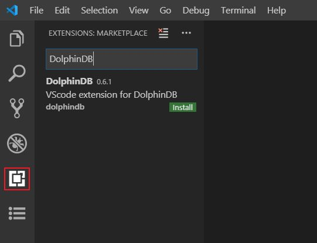
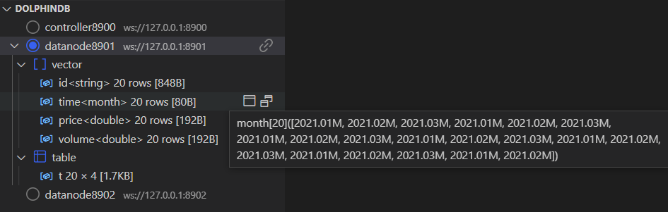
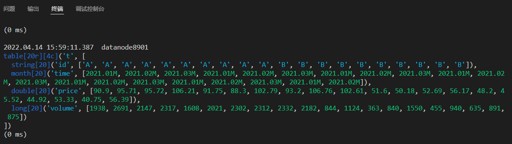
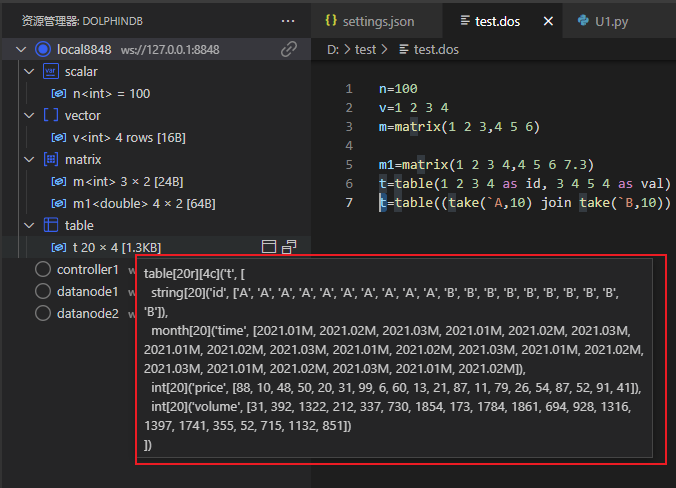
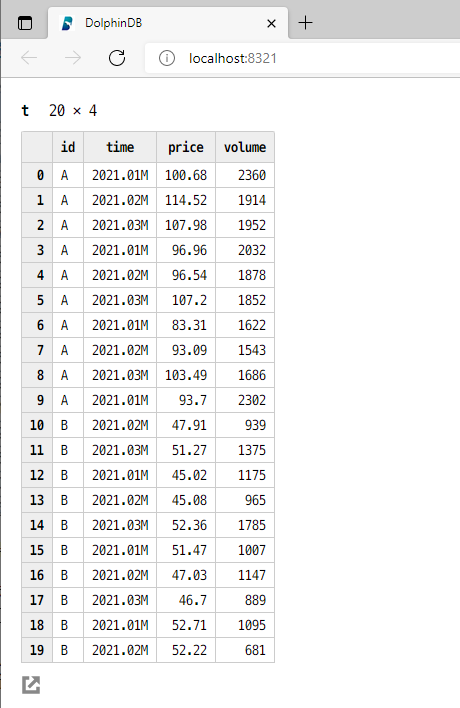
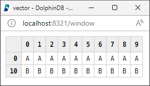

# DolphinDB VSCode 用户手册

本教程目录如下：

- [DolphinDB VSCode 用户手册](#dolphindb-vscode-用户手册)
  - [安装和使用](#安装和使用)
    - [下载安装](#下载安装)
    - [编辑服务器连接配置](#编辑服务器连接配置)
    - [新建脚本文件](#新建脚本文件)
      - [函数的自动补齐和文档实时浏览](#函数的自动补齐和文档实时浏览)
    - [执行代码](#执行代码)
      - [在线浏览数据和生成的对象](#在线浏览数据和生成的对象)
    - [VSCode 视窗](#vscode-视窗)

VSCode 是微软开发的一款轻量、高性能又有极强扩展性的代码编辑器。它提供了强大的插件框架，允许用户安装插件来支持新的编程语言。DolphinDB 公司开发了支持 DolphinDB 数据库编程语言的 VSCode 插件。

安装 DolphinDB VSCode 插件后，就可以通过 VSCode 以 DolphinDB 语言编写脚本并在 DolphinDB 服务器上运行。

DolphinDB VSCode 插件允许用户：

- 通过修改配置文件与 DolphinDB 服务器进行连接。
- 支持不断连的切换连接。
- 创建项目，编辑和管理脚本。
- 显示代码高亮，支持关键字、常量、内置函数的代码补全。
- 内置函数参数提示、实时查看函数功能及用法。
- 执行脚本，并在终端中展示 print 消息以及执行结果。
- 管理数据库。可在线观察会话变量。
- 通过浏览器在线浏览数据表/向量/矩阵等数据结构，支持数据更新后的刷新显示。

在使用 DolphinDB VSCode 插件之前，需要启动 DolphinDB 服务器。

## 安装和使用

下载 DolphinDB 插件前，需要安装或升级 VSCode 到v1.66.0及以上版本  ( https://code.visualstudio.com/ )。

### 下载安装

点击 VSCode 左侧导航栏的 Extensions 图标，或者通过 `Ctrl+Shift+X` 快捷键打开插件安装窗口。在搜索框中输入 dolphindb，即可搜索到 dolphindb 插件，点击 Install 进行安装。具体方法可查看插件详情。


如果因为网络原因安装失败，需通过下方链接手动下载后缀为 `.vsix` 的插件，击 `Version History` 下载最新的版本到本地，并将其拖到 VSCode 插件面板中。  
https://marketplace.visualstudio.com/items?itemName=dolphindb.dolphindb-vscode

注意：安装后需重启 VSCode 使插件生效。

### 编辑服务器连接配置

点击菜单栏中的  `文件 > 首选项 > 设置` (`File > Preferences > Settings`)  或者按快捷键 `Ctrl + 逗号` 打开 VSCode 设置。在搜索框中输入 dolphindb，点击下方的 `在 settings.json 中编辑`，编辑 里面的 `dolphindb.connections` 配置项。  
`dolphindb.connections` 下的一个 `{...}` 对象，表示一个连接配置。用户可通过手动修改该对象，来创建或删除会话连接。每个对象包含6个属性，其中 `name` 和 `url` 是必填属性。需注意：不同的连接对象必须配置不同的 `name`。移动鼠标至属性名上，可查看属性的具体说明。  

```
"dolphindb.connections": [
  //一个连接配置如下：
    {
        "name": "local8848", // 连接的别名。同一个服务器可以有多个不同的连接
        "url": "ws://127.0.0.1:8848", // DolphinDB 服务器 ip 和 port，格式为 "ws://ip:port"
        "autologin": true, // 是否开启自动登录。需配置用户名密码才生效
        "username": "admin",
        "password": "123456",
        "python": false // 默认值为 false。若设置为 true，将使用 Python Parser 来解析执行脚本。
    }
]
```

配置连接后，用户可以通过编辑器左侧面板资源管理器下的 DOLPHINDB 窗口查看并切换连接。选中连接并在该连接下执行脚本后便会自动连接到服务器。切换服务器连接后，原连接不会断开。

注意：若修改了连接配置项，原连接会自动断开。



### 新建脚本文件

- 如果脚本文件名后缀是 .dos ，插件会自动识别为 DolphinDB 语言。
- 如果脚本文件名后缀非 .dos，比如是 .txt，则需要手动关联 DolphinDB 语言。方法如下：点击 VSCode 编辑器右下角状态栏的语言选择按钮，如下图：


在语言选择弹框中输入 dolphindb 后回车，即可切换当前文件关联的语言为 DolphinDB 语言。


#### 函数的自动补齐和文档实时浏览

用户在 VSCode 编辑器输入函数时，将自动补齐函数名，且可展开函数的具体信息。将光标悬浮至对应函数可自动显示该函数对应的文档。


### 执行代码

VSCode 中默认通过快捷键 `Ctrl + E` 来执行选中的代码；若没有选中代码，则会执行当前光标所在的行。如果需要自定义代码执行的快捷键，则需在 VSCode 的 `文件 > 首选项 > 键盘快捷方式` (`File > Preferences > Keyboard Shortcuts`) 中进行修改。在搜索栏中输入 dolphindb，找到 execute 并双击，根据提示修改快捷键。

#### 在线浏览数据和生成的对象

VSCode 编辑器左侧面板资源管理器中展示了连接的会话，用户可在此查看会话中的所有变量。这里展示了变量的名称、类型、维度以及占用的内存大小。用户也可点击变量栏右侧的图标在浏览器浏览该变量具体信息。

请确保以下两点，以避免服务器出现连接错误 (如：ws://xxx errored)：

- DolphinDB Server 版本不低于 1.30.16 或 2.00.4 。
- 如果配置了系统代理，则代理软件以及代理服务器需要支持 WebSocket 连接。否则请在系统中关闭代理，或者将 DolphinDB Server 的 IP 添加到排除列表，然后重启 VSCode。

### VSCode 视窗

- 查看连接及变量



VSCode 左侧资源管理器下的 DOLPHINDB 资源，以树状形式展示了配置文件里的所有连接，以及连接内部的变量信息。

**连接列表**：点击连接左侧圆形图标选择并切换到该连接。点击连接右侧的断开链接图标可断开该连接。

**变量列表**：鼠标悬浮于对应变量，可查看该变量的数据结构。变量（scalar 和 pair 类型除外）右侧有两个图标，分别用于查看变量和在新窗口中查看变量。

- 数据浏览器

VSCode 中的变量可以在终端、左侧资源管理器以及浏览器中显示。其中，前两种以文本格式显示变量的数据结构，而第三种以表格方式显示。

**终端**



执行结果的第一行显示代码的执行时间，会话对应的服务器别名。

以表为例，打印执行结果见上图：

- 首先，显示数据形式，此处为 table。[20r][4c] 表示该表是一个 20 行 4 列的数据表。
- 然后，依次打印每列的数据类型，长度，列名以及包含的数据。
- 最后，显示代码执行的耗时。
  
**左侧资源管理器显示**



鼠标悬浮于资源管理器的变量上，便可查看该变量的具体内容。同终端打印变量的形式，资源管理器也以文本方式展示变量。

**浏览器显示**

为了在浏览器中以表格方式展示 DolphinDB 中的向量、矩阵和表，每个 VSCode 窗口会启动一个本地 HTTP 服务器，用于浏览器页面展示这些变量。默认情况下，HTTP 服务器可用端口范围为[8321,8420]。打开 VSCode 窗口时， HTTP 服务器会从第一个8321开始按照顺序查找首个可用的 port 做为实际监听的端口。

DolphinDB 提供配置项 `dolphindb.ports `，允许用户自行配置端口号。将鼠标悬浮 `dolphindb.ports ` 上可查看它的详细解释及配置方法。

浏览变量的方法为：点击变量右侧的查看变量图标，打开一个浏览器页面（localhost:port）。在该页面查看当前变量的数据结构。变量更新后，重新执行变量，或再次点击查看变量图标，可以刷新变量值。



点击在新窗口中查看变量图标，会打开浏览器弹窗（请开启浏览器允许弹框功能），便于用户同时查看多个变量及观察变量前后的变化（如下图）。

