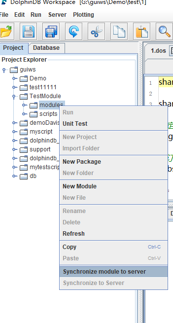

## DolphinDB教程：模块

在使用DolphinDB的脚本进行开发时，可以使用 module 和 use 方法，来声明和使用可复用模块。

### 1. Module(模块)介绍

在DolphinDB中，模块是只包含函数定义的代码包。它具有以下特点：

* 模块文件保存在[home]/modules目录下。
* 模块文件名的后缀为.dos（"dolphindb script"的缩写）或.dom（"dolphindb module"的缩写）。
* 模块文件第一行只能使用 module 后接模块名以声明模块，例如 module fileLog 。 
* 模块文件除第一行外的内容仅可包含函数定义。

### 2. 定义模块

#### 2.1 创建模块目录

所有的模块定义一般存放在[home]/modules目录下。[home]目录由系统配置参数 home 决定，可以通过`getHomeDir()`函数查看。

节点的模块目录可以由配置参数moduleDir来指定，其默认值是相对路径modules，系统会首先到节点的home目录寻找该目录，如果没有找到，会依次在节点的工作目录与可执行文件所在目录寻找。

#### 2.2 创建模块文件

可在modules目录下创建以.dos为后缀的模块文件，例如fileLog.dos。模块文件的第一行必须是模块声明语句。例如在fileLog.dos中声明模块：
```
module fileLog
```
这里的fileLog是模块名，必须与模块文件(fileLog.dos)的名称一致。

模块文件除第一行外的内容仅可包含函数定义。例如，fileLog模块仅包括向指定日志文件写入日志的函数`appendLog`：
```
module fileLog

def appendLog(filePath, logText){
	f = file(filePath,"a+")
	f.writeLine(string(now()) + " : " + logText)
	f.close()
}
```

在模块文件中，**仅允许封装函数定义，其他非函数定义代码将被忽略**。

#### 2.3 序列化模块文件

使用`saveModule`函数可以将module序列化成扩展名为dom的二进制文件。将module序列化为dom文件能够增强代码的保密性和安全性。例如，序列化2.2中的module fileLog：

```
saveModule("fileLog")
```

dom文件会保存至dos文件所在的目录。

注意，如果dos文件的内容发生改变，需要重新执行`saveModule`函数来生成新的dom文件。可将`saveModule`函数的overwrite参数设置为true来覆盖已有的dom文件。例如：

```
saveModule("fileLog" , , true)
```

### 3. 导入模块

#### 3.1 使用use关键字

使用`use`关键字来导入一个模块。注意，`use`关键字导入的模块是会话隔离的，仅对当前会话有效。导入模块后，可以通过以下两种方式来使用模块内的自定义函数：

(1) 直接使用模块中的函数：
```
use fileLog
appendLog("mylog.txt", "test my log")
```

(2) 通过模块中的函数的完整路径来调用：
```
use fileLog
fileLog::appendLog("mylog.txt", "test my log")
```
若导入的不同模块中含有相同名称的函数，则必须通过此种方式调用此类函数。

#### 3.2 将模块内函数加载为系统内置函数

>该功能在1.20.1及以上版本支持。

3.1节提到，`use`关键字导入的模块是会话隔离的，这在实际使用中会带来一些不便。为了解决这一问题，DolphinDB支持将模块定义的函数加载为系统的内置函数，这样模块对所有会话都是可见的。

模块定义的函数成为内置函数之后，具有以下特点：

- 用户无法覆盖函数的定义。
- 如果在`remoteRun`或`rpc`中使用了该函数，系统不会序列化该函数的定义到远程节点。因此远程节点也必须加载了该模块，否则系统会抛出无法找到函数的异常。
- 该函数在系统内存中只有一份，且对所有会话可见。不仅节约了内存，还减少了每个会话加载模块的时间。另外，调用模块的代码更加简洁，无需使用use关键字导入模块，API调用模块函数更加方便。
- 如果加载的模块依赖了其他模块，系统会自动加载其他模块。

可通过`loadModule`函数或者配置参数preloadModules将模块函数加载成内置函数。加载模块时，既可以使用dos文件，也可以使用dom文件。系统会自动到modules目录寻找模块文件。如果同时包含dos文件和dom文件，系统只加载dom文件。如果加载的是dom文件，用户无法查看模块函数的定义。

##### 3.2.1 通过loadModule函数加载

通过`loadModule`函数来加载模块。需要注意的是，该函数只能在系统的初始化脚本中使用（默认是dolphindb.dos），不能在命令行或者gui中执行。例如，加载2.2中的module fileLog，在dolphindb.dos文件末尾加上：

```
loadModule("fileLog")
```

##### 3.2.2 通过配置参数preloadModules加载

亦可通过配置参数preloadModules来指定要加载的模块。对单机版，该参数在dolphindb.cfg中配置。对集群版，通常需要为controller和datanode加载相同的模块，最简单的方法在controller.cfg和cluster.cfg配置preloadModules参数。

例如：

```
preloadModules=fileLog
```
如果需要加载多个模块，使用逗号分隔。

> loadModule函数和preloadModule除了可以加载模块，也可以加载插件。例如，加载mysql插件：
>```
>loadModule("plugins::mysql")
>preloadModules=plugins::mysql
>```


##### 3.2.3 与函数视图（function view）的区别

通过`loadModule`或`preloadModules`生成的内置函数与function view对比，有以下4点区别：

- dom模块的函数对所有人均不可见，包括系统管理员和owner，保密性更高。function view对admin和owner以及授权以外的人不可见。
- 与插件和系统内置函数相同，模块函数一旦加载后，除非重启系统，否则不可覆盖。function view仍然可以被owner和admin覆盖。
- 所有模块都会有模块名称。function view目前不支持域名限定。
- 序列化一个模块时，不会序列化依赖的函数，只会序列化依赖的模块名称。而function view序列化时，会序列化所有的依赖，以及依赖的依赖，实现self-contained。

因此，function view和module的应用场景有所不同。function view一般用于跟数据库相关的数据访问。模块中的函数一般是通用的处理逻辑或算法。function view可能会调用模块中的函数，但是模块中的函数一般不调用function view。

### 4. 模块分类

#### 4.1 声明模块类别命名空间

如果需要对模块进行分类，可在modules目录下设置多个子目录，以作为不同模块类别的命名空间。例如，现有两个模块fileLog和dateUtil，它们的存放路径分别为 modules/system/log/fileLog.dos 与 modules/system/temperal/dateUtil.dos，那么这两个模块相应的声明语句分别为 ```module system::log::fileLog``` 与 ```module system::temperal::dateUtil```。

#### 4.2 调用命名空间模块

可在`use`关键字后加完整路径来导入命名空间下的模块。例如，导入4.1小节中的fileLog模块：
```
use system::log::fileLog
```
需要注意的是，在使用saveModule, loadModule以及preloadModules时，均需要全路径。

直接调用其中函数：
```
appendLog("mylog.txt", "test my log")
```
使用全路径调用其中函数：
```
system::log::fileLog::appendLog("mylog.txt", "test my log")
```


### 5. GUI中远程调试模块

当GUI所在机器与DolphinDB服务器不是同一台机器时，在GUI中编辑的模块代码，需要先上传到远程服务器的[home]/modules目录，才能通过use语句调用模块。

DolphinDB GUI从0.99.2版本开始提供了远程同步模块的功能，具体用法如下图所示：



此操作会将modules目录下的所有文件和子目录同步到GUI连接的DolphinDB节点的[home]/modules目录下。同步完成后，就可以在远程服务器上执行use语句导入模块。

### 6. 注意事项

#### 6.1 同名函数定义规则

不同模块中可以定义相同名字的函数。如果使用全路径调用函数，可以通过模块命名空间来区分函数名。

如果直接调用函数：

* 若只有一个已导入模块包含该函数，DolphinDB会调用该模块的函数。

* 若多个已导入模块包含该函数，会抛出异常：
```
Modules [Module1] and [Module2] contain function [functionName]. Please use module name to qualify the function.
```
* 若所有已导入的模块中均不包含该函数，DolphinDB会在系统内置函数中搜索该函数。如果内置函数中也没有该函数，将抛出函数未定义的异常。

若已导入模块中某函数与某自定义函数重名，系统会默认使用模块中的函数。如果要调用自定义函数，需要声明命名空间。自定义函数和内置函数的默认命名空间为根目录，用两个冒号表示。

下例中，首先创建自定义函数`myfunc`：
```
login("admin","123456")
def myfunc(){
 return 1
}
addFunctionView(myfunc)
```
然后定义模块sys，其中含有函数`myfunc`。
```
module sys
def myfunc(){
 return 3
}
```
若要调用模块sys中的函数`myfunc`，可在使用
```
use sys
```
之后，使用：
```
sys::myfunc()
```
或：
```
myfunc()
```
若要使用模块外的自定义函数，可使用：
```
::myfunc()
```

#### 6.2 刷新模块定义

若需要在测试过程中快速反复修改模块代码并刷新定义，可在模块文件修改后执行全部的模块代码。这种方法仅对当前会话有效。

#### 6.3 模块间互相调用

* 模块之间可以单向引用，例如允许模块a引用b，b引用c。

* 模块之间不支持交叉引用，例如不允许模块a引用b，模块b又引用a。